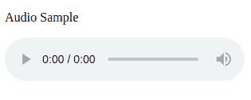
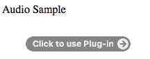

# HTML5

<audio>标签</audio>

> 原文:[https://www.geeksforgeeks.org/html5-audio/](https://www.geeksforgeeks.org/html5-audio/)

自 HTML5 发布以来，音频可以使用“音频”标签添加到网页中。以前，音频只能在网页上使用网页插件(如 Flash)播放。“音频”标签是一个内嵌元素，用于将声音文件嵌入到网页中。如果您想在网页上添加歌曲、采访等音频，这是一个有用的标签。

**语法:**

```html
<audio>
  <source src="sample.mp3" type="audio/mpeg">
</audio>
```

**属性:**可与“音频”标签一起使用的各种属性如下:

*   [**控制**](https://www.geeksforgeeks.org/html-controls-attribute/) **:** 指定音频播放器显示哪些控制。
*   [**【自动播放】**](https://www.geeksforgeeks.org/html-autoplay-attribute/) **:** 指定音频文件加载控件后将立即播放。
*   [**循环**](https://www.geeksforgeeks.org/html-loop-attribute/) **:** 表示音频文件应连续重复。
*   [](https://www.geeksforgeeks.org/html-src-attribute/)****:**指定音频文件的网址。**
*   **[](https://www.geeksforgeeks.org/html-muted-attribute/)****:**表示音频文件应该静音。**** 

******支持的格式:**html 5 支持 mp3、ogg、wav 三种格式。不同浏览器对每种格式的支持如下:**** 

<figure class="table">

| 浏览器 | MP3 文件 | 声音资源文件 | OGG |
| 谷歌 Chrome | 是 | 是 | 是 |
| 微软公司出品的 web 浏览器 | 是 | 不 | 不 |
| 火狐浏览器 | 是 | 是 | 是 |
| 歌剧 | 是 | 是 | 是 |
| 旅行队 | 是 | 是 | 不 |

</figure>

****以下示例解释了音频标签:****

******示例 1(在网页上添加音频):**controls 属性用于添加音频控件，如播放、暂停和音量。“source”元素用于指定浏览器可以使用的音频文件。浏览器使用第一个识别的格式。****

## ****超文本标记语言****

```html
**<!DOCTYPE html>
<html>

<body>

    <p>Audio Sample</p>

    <!-- audio tag starts here -->
    <audio controls>
        <source src="test.mp3" type="audio/mp3">
        <source src="test.ogg" type="audio/ogg">
    </audio>
    <!-- audio tag ends here --> 

</body>

</html>**
```

******输出:****** 

********

******示例 2(在网页上自动播放音频):**每当加载网页的 URL 时，自动播放属性用于自动开始播放音频文件。****

## ****超文本标记语言****

```html
**<!DOCTYPE html>
<html>

<body>

    <p>Audio Sample</p>

    <!-- audio tag starts here -->
    <audio controls autoplay>
        <source src="test.mp3" type="audio/mp3">
        <source src="test.ogg" type="audio/ogg">
    </audio>
    <!-- audio tag ends here -->
</body>

</html>**
```

******输出:****** 

********

******示例 3(在网页上添加静音的音频文件):**静音属性指定音频在网页上应该静音。****

## ****超文本标记语言****

```html
**<!DOCTYPE html>
<html>

<body>

    <p>Audio Sample</p>

    <!-- audio tag starts here -->
    <audio controls muted>
        <source src="test.mp3" type="audio/mp3">
        <source src="test.ogg" type="audio/ogg">
    </audio>
    <!-- audio tag ends here -->
</body>

</html>**
```

******输出:****** 

********

******示例 4(使用源元素添加音频):**源元素可用于向网页添加音频文件。src 属性用于指定指定文件的来源。****

## ****超文本标记语言****

```html
**<!DOCTYPE html>
<html>

<body>

    <p>Audio Sample</p>

    <!-- audio tag starts here -->
    <audio controls autoplay>
        <source src="test.mp3" type="audio/mp3">
    </audio>
    <!-- audio tag ends here -->

</body>

</html>**
```

******输出:****** 

********

******示例 5(添加具有多个来源的音频):**指定了多个来源的音频，以便如果浏览器无法播放第一个来源，则它将自动跳转到第二个来源并尝试播放。****

## ****超文本标记语言****

```html
**<!DOCTYPE html>
<html>

<body>

    <p>Audio Sample</p>

    <!-- audio tag starts here -->
    <audio controls autoplay>
        <source src="test.mp3" type="audio/mp3">
        <source src="test.ogg" type="audio/ogg">
        <source src="test.opus" type="audio/ogg">
    </audio>
    <!-- audio tag ends here -->

</body>

</html>**
```

******输出:****** 

********

******示例 6(使用“嵌入”标签添加音频):**使用“嵌入”标签在网页上添加音频是一种古老的技术。这种方法确实有效，但相对来说不如其他方法有效。用户必须有一个像 MIDI 或 QuickTime 这样的插件，因为嵌入标签需要一个插件来支持。****

## ****超文本标记语言****

```html
**<!DOCTYPE html>
<html>

<body>

    <p>Audio Sample</p>

    <!-- embed code starts here -->
    <embed src="test.mp3" width="200" height="50" 
                     autoplay="true" loop="true">
    <!-- embed code ends here -->
</body>

</html>**
```

******输出:******

********

******支持的浏览器:******

*   ****谷歌 Chrome 4.0****
*   ****Internet Explorer 9.0****
*   ****Firefox 3.5****
*   ****歌剧 10.5****
*   ****Safari 4.0****