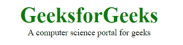

# HTML5 完整参考

> 原文:[https://www.geeksforgeeks.org/html5-complete-reference/](https://www.geeksforgeeks.org/html5-complete-reference/)

超文本标记语言代表超文本标记语言。它用于使用标记语言设计网页。HTML 是超文本和标记语言的结合。超文本定义了网页之间的链接。标记语言用于在定义网页结构的标签中定义文本文档。

[HTML 5](https://www.geeksforgeeks.org/html5-introduction/) 是 HTML 的第五个也是目前的版本。它改进了文档可用的标记，并引入了应用程序编程接口和文档对象模型。

下面的例子说明了 HTML 5 的内容。

**示例:**

```html
<!DOCTYPE html> 
<html> 

<head> 
    <title>HTML 5 Demo</title> 

    <style> 
        .GFG { 
            font-size:40px; 
            font-weight:bold; 
            color:green; 
        } 
        body { 
            text-align:center; 
        } 
    </style> 
</head> 

<body> 
    <div class = "GFG">GeeksforGeeks</div> 
    <aside> 
        <div>A computer science portal for geeks</div> 
    </aside> 
</body> 

</html>                     
```

**输出:**



**特征:**

*   它引入了新的多媒体功能，通过使用

    <audio>和<video>标签支持音频和视频控制。</video></audio>

*   有新的图形元素，包括矢量图形和标签。
*   通过加入

    <header>

    <footer>

    <article>

    <section>

    <figure>来丰富语义内容。</figure>

    </section>

    </article>

    </footer>

    </header>

*   拖放-用户可以抓取一个对象，并将其进一步拖放到新的位置。
*   地理定位服务-它有助于定位客户的地理位置。
*   网络存储设备，提供网络应用方法在网络浏览器上存储数据。
*   使用 SQL 数据库脱机存储数据。
*   允许绘制各种形状，如三角形、矩形、圆形等。
*   能够处理不正确的语法。
*   简易 DOCTYPE 声明，即
*   简单字符编码，即

**完整参考:**

*   [HTML5 |简介](https://www.geeksforgeeks.org/html5-introduction/)
*   [HTML5 |编辑器](https://www.geeksforgeeks.org/html-editors/)
*   [HTML5 |基础知识](https://www.geeksforgeeks.org/html-basics/)
*   [HTML5 |属性](https://www.geeksforgeeks.org/html-attributes/)
*   [HTML5 |段落](https://www.geeksforgeeks.org/html-paragraph/)
*   [HTML5 |文本格式](https://www.geeksforgeeks.org/html-text-formatting/)
*   [HTML5 |报价](https://www.geeksforgeeks.org/html-quotations/)
*   [HTML5 |表格](https://www.geeksforgeeks.org/html-tables/)
*   [HTML5 |列表](https://www.geeksforgeeks.org/html-lists/)
*   [HTML5 |拼写检查](https://www.geeksforgeeks.org/html-spell-check/)
*   [HTML5 |颜色样式和 HSL](https://www.geeksforgeeks.org/html-color-styles-hsl/)
*   html 5 |地理位置
*   [HTML5 |拖放](https://www.geeksforgeeks.org/html-drag-and-drop/)
*   [HTML5 | Charsets](https://www.geeksforgeeks.org/html-charsets/)
*   [HTML5 |图片](https://www.geeksforgeeks.org/html-images/)
*   html 5 | doctypes
*   [HTML5 |布局](https://www.geeksforgeeks.org/html-layout/)
*   [HTML5 |文件路径](https://www.geeksforgeeks.org/html-file-paths/)
*   [HTML5 | Iframes](https://www.geeksforgeeks.org/html-iframes/)
*   [HTML5 |链接](https://www.geeksforgeeks.org/html-links/)
*   [HTML5 |不推荐使用的标签](https://www.geeksforgeeks.org/html-deprecated-tags/)
*   [HTML5 |网址编码](https://www.geeksforgeeks.org/html-url-encoding/)
*   [HTML5 | SVG 基础](https://www.geeksforgeeks.org/html-svg-basics/)
*   [HTML5 |画布基础](https://www.geeksforgeeks.org/html-canvas-basics/)
*   [HTML5 |计算机代码元素](https://www.geeksforgeeks.org/html-computer-code-elements/)
*   [HTML5 |实体](https://www.geeksforgeeks.org/html-entities/)
*   [HTML5 |画布 drawImage()方法](https://www.geeksforgeeks.org/html-canvas-drawimage-method/)
*   [HTML5 |模板标签](https://www.geeksforgeeks.org/html-template-tag/)
*   [HTML5 | dropzone 属性](https://www.geeksforgeeks.org/html-dropzone-attribute/)
*   [HTML5 | rp 标记](https://www.geeksforgeeks.org/html5-rp-tag/)
*   [HTML5 | rt 标签](https://www.geeksforgeeks.org/html5-rt-tag/)
*   [HTML5 | <红宝石>标签](https://www.geeksforgeeks.org/html5-ruby-tag/)
*   [HTML5 |图标签](https://www.geeksforgeeks.org/html5-figure-tag/)
*   [HTML5 | figcaption Tag](https://www.geeksforgeeks.org/html5-figcaption-tag/)
*   [HTML5 |字段集标签](https://www.geeksforgeeks.org/html5-fieldset-tag/)
*   [HTML5 | <头像>标签](https://www.geeksforgeeks.org/html-head-tag/)
*   [HTML5 | <对话框>标签](https://www.geeksforgeeks.org/html5-dialog-tag/)
*   [HTML5 | < bdi >标签](https://www.geeksforgeeks.org/html-5-bdi-tag/)
*   [HTML5 | <进度>标签](https://www.geeksforgeeks.org/html-5-progress-tag/)
*   [HTML5 | <仪表>标签](https://www.geeksforgeeks.org/html5-meter-tag/)
*   [HTML5 | < wbr >标签](https://www.geeksforgeeks.org/html-5-wbr-tag/)
*   [HTML5 |标记标签](https://www.geeksforgeeks.org/html5-mark-tag/)
*   [HTML5 | <表头>标签](https://www.geeksforgeeks.org/html-5-header-tag/)
*   [HTML5 | <页脚>标签](https://www.geeksforgeeks.org/html5-footer-tag/)
*   [HTML5 |文章标签](https://www.geeksforgeeks.org/html5-article-tag/)
*   [HTML5 | <一旁>标签](https://www.geeksforgeeks.org/html5-aside-tag/)
*   [HTML5 | <版块>标签](https://www.geeksforgeeks.org/html-section-tag/)
*   [HTML5 | <总结>标签](https://www.geeksforgeeks.org/html-5-summary-tag/)
*   [HTML5 | <详情>标签](https://www.geeksforgeeks.org/html5-details-tag/)
*   [HTML5 |语义](https://www.geeksforgeeks.org/html5-semantics/)
*   [HTML5 |数学运算符](https://www.geeksforgeeks.org/html5-mathematical-operators/)
*   [HTML5 |视频](https://www.geeksforgeeks.org/html5-video/)