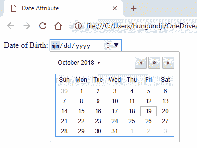
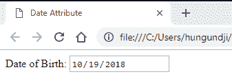
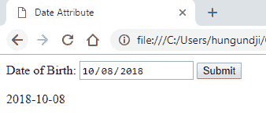
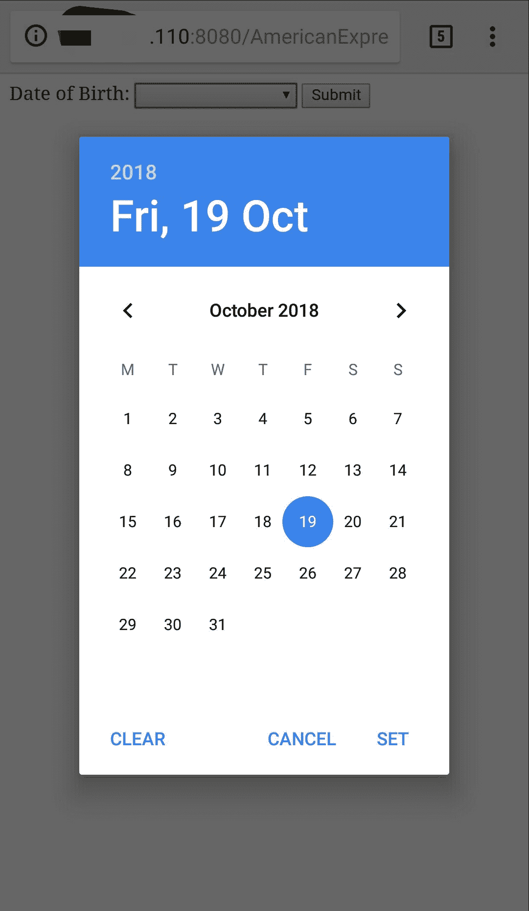

# HTML5 |日期属性在<input>标签

> 原文:[https://www . geesforgeks . org/html 5-输入标签中的日期属性/](https://www.geeksforgeeks.org/html5-date-attribute-in-input-tag/)

输入标签中的日期属性创建一个日历来选择日期，包括日、月和年。

**语法:**

```html
<input type = "date">
```

**示例 1:** 在输入标签中使用日期属性

```html
<!DOCTYPE html>
<html>
    <head>
        <title>Date Attribute</title>
    </head>
    <body>
        <form action="/">
            Date of Birth: <input type = "date">
        </form>
    </body>
</html>                    
```

**输出:**


**示例 2:** 初始化输入标签中的默认日期值。输入标签中的日期格式为 value =“yyyy-mm-DD”

```html
<html>
    <head>
        <title>Date Attribute</title>
    </head>
    <body>
        <form action="/">
            Date of Birth: <input type="date" value="2018-10-19">
        </form>
    </body>
</html>
```

**输出:**


**示例 3:** 日期属性的 DOM

```html
<!DOCTYPE html>
<html>
    <head>
        <title>Date Attribute</title>
    </head>
    <body>
        Date of Birth:
        <input type="date" id="dob">
        <button onclick="dateDisplay()">Submit</button>
        <p id="demo"></p>
        <script>
            function dateDisplay() {
                var x = document.getElementById("dob").value;
                document.getElementById("demo").innerHTML = x;
            }
        </script>
    </body>
</html>
```

**输出:**


**手机中的输出:**
