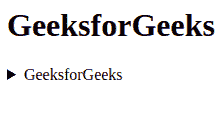
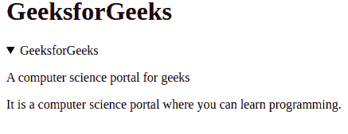

# HTML5 | <details>标签</details>

> 原文:[https://www.geeksforgeeks.org/html5-details-tag/](https://www.geeksforgeeks.org/html5-details-tag/)

<details>标签用于最初隐藏的内容/信息，但如果用户希望查看，可以显示。该标签用于创建用户可以打开或关闭的交互式小部件。打开设置属性时，详细信息标签的内容可见。摘要标签与**详细信息**标签一起用于指定可见标题。</details>

**语法:**

```html
<details>
    <summary>  Text content  </summary>
    <div> Content . . . >
</details>
```

**属性:**

[**明细打开**](https://www.geeksforgeeks.org/html-details-open-attribute/) **:** 明细标签有一个属性叫做**打开**，默认用来显示隐藏信息。

**示例:**下面的代码解释了细节标签。

## 超文本标记语言

```html
<!DOCTYPE html>
<html>
    <body>
        <h1>GeeksforGeeks</h1>
        <!-- details tag starts here -->
        <details>
            <summary>GeeksforGeeks</summary>

<p>A computer science portal for geeks</p>

            <div>It is a computer science portal where you
            can learn programming.</div>
         <!-- details tag ends here -->
        </details>
    </body>
</html>
```

**输出:**



**语法:**

```html
<details open>
    <summary>  Text content  </summary>
    <div> Content . . . >
</details>
```

**示例:**下面的代码解释了 details 标签中的 details open 标签。

## 超文本标记语言

```html
<!DOCTYPE html>
<html>
    <body>
        <h1>GeeksforGeeks</h1>
        <!-- details open tag starts here -->
        <details open>
            <summary>GeeksforGeeks</summary>

<p>A computer science portal for geeks</p>

            <div>It is a computer science portal where you
            can learn programming.</div>
         <!-- details open tag ends here -->
        </details>
    </body>
</html>                   
```

**输出:**



**支持的浏览器:**

*   谷歌 Chrome 12.0 及以上版本
*   Firefox 49.0 及以上版本
*   Opera 15.0 及以上版本
*   Safari 6.0 及以上版本