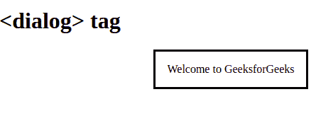

# HTML5 <dialog>标签</dialog>

> 原文:[https://www.geeksforgeeks.org/html5-dialog-tag/](https://www.geeksforgeeks.org/html5-dialog-tag/)

<dialog>标签用于指定对话框或窗口。该标签用于在网页上创建弹出对话框和模型。这个标签在 HTML5 中是新的。</dialog> 

**语法:**

```html
<dialog open> Contents... </dialog>
```

**属性:**该标签接受单个属性 [*打开*](https://www.geeksforgeeks.org/html-open-attribute/) ，用于指定对话框元素处于活动状态，用户可以与标签元素交互。
**例:**

## 超文本标记语言

```html
<!DOCTYPE html>
<html>  
    <body>
        <h1><dialog> tag</h1>

         <!--This is an open dialog Tag-->
        <dialog open>Welcome to GeeksforGeeks</dialog>
    </body>
</html>
```

**输出:**



**支持的浏览器:**

*   谷歌 Chrome 37.0
*   Firefox 59.0
*   Opera 24.0
*   Safari 6.0