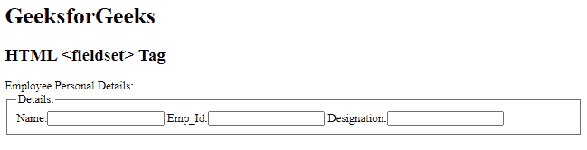
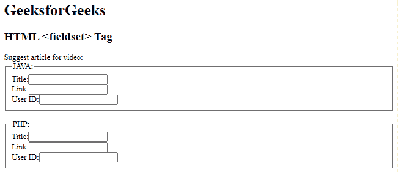

# HTML5 字段集标签

> 原文:[https://www.geeksforgeeks.org/html5-fieldset-tag/](https://www.geeksforgeeks.org/html5-fieldset-tag/)

**示例:**这个简单的示例说明了如何使用<字段集>标签在 HTML 表单中创建一组相关的元素。

## 超文本标记语言

```html
<!DOCTYPE html>
<html>
<body>
    <h1>GeeksforGeeks</h1>
    <h2>HTML <fieldset> Tag</h2>
    <form>
        <div class="title">
            Employee Personal Details:
        </div>

        <!--HTML fieldset tag starts here-->
        <fieldset>
            <legend>Details:</legend>
            Name:<input type="text"> 
            Emp_Id:<input type="text"> 
            Designation:<input type="text">        
        </fieldset>
        <!--HTML fieldset tag ends here-->
    </form>
</body>
</html>
```

**输出:**



HTML5 中的

<fieldset>标签用于在表单中制作一组相关的元素，并在元素上创建一个框。

<fieldset>标签在 HTML5 中是新的。 [<图例>标签](https://www.geeksforgeeks.org/html-legend-tag/#:~:text=The%20legend%20tag%20is%20used,for%20the%20element.)用于定义孩子内容的标题。图例元素是父元素。该标签用于定义<字段集>元素的标题。</fieldset>

</fieldset>

**语法:**

```html
<fieldset> Contents... </fieldset>
```

**属性:**

*   [**禁用**](https://www.geeksforgeeks.org/html-fieldset-disabled-attribute/) **:用于指定相关表单元素组禁用。禁用的字段集不可点击且不可用。**
*   [**表单**](https://www.geeksforgeeks.org/html-fieldset-form-attribute/) **:** 用于指定<字段集>元素所属的一个或多个表单。
*   [**名称**](https://www.geeksforgeeks.org/html-fieldset-name-attribute/) **:** 用于指定 Fieldset 元素的名称。
*   [**【自动完成】**](https://www.geeksforgeeks.org/html-fieldset-autocomplete-attribute/#:~:text=The%20HTML%20autocomplete%20attribute,which%20the%20user%20entered%20before.) **:** 用于指定字段集有自动完成开或关值。

**示例:**在本例中，我们将知道使用< fieldset >标记来组成相关元素的组。

## 超文本标记语言

```html
<!DOCTYPE html>
<html>
<body>
    <h1>GeeksforGeeks</h1>
    <h2>HTML <fieldset> Tag</h2>
    <form>
        <div class="title">
          Suggest article for video:
        </div>

        <!--HTML fieldset tag starts here-->
        <fieldset>
            <legend>JAVA:</legend>
            Title:<input type="text"><br>
            Link:<input type="text"><br>
            User ID:<input type="text">
        </fieldset>
        <!--HTML fieldset tag ends here-->

        <br>

        <!--HTML fieldset tag starts here-->
        <fieldset>
            <legend>PHP:</legend> 
            Title:<input type="text"><br>
            Link:<input type="text"><br>
            User ID:<input type="text"> 
        </fieldset>
        <!--HTML fieldset tag ends here-->
    </form>
</body>
</html>
```

**输出:**



**支持的浏览器:**

*   谷歌 Chrome 93.0 及以上
*   Internet Explorer 11.0
*   微软边缘 93.0
*   火狐 92.0 及以上版本
*   Safari 14.1
*   Opera 78.0