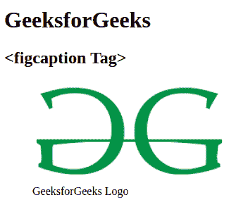

# html 5 figcaption tag

> 哎哎哎:# t0]https://www . geeksforgeeks . org/html 5-figcaption-tag/

HTML 中的<figurecaption>标记用于为文档中的图形元素设置标题。这个标签在 HTML5 中是新的。</figurecaption> 

**语法:**

```html
<figcaption> Figure caption </figcaption>
```

**例 1:**

## 超文本标记语言

```html
<!DOCTYPE html>

<html>

    <body>

        <h1>GeeksforGeeks</h1>
        <h2><figcaption Tag></h2>
        <figure>
        
        <!--HTML figcaption tag starts here-->
        <figcaption>
            GeeksforGeeks Logo
        </figcaption>
        <!--HTML figcaption tag ends here-->
        </figure>

    </body>

</html>                   
```

**输出:**



**例 2:**

## 超文本标记语言

```html
<!DOCTYPE html>

<html>

    <body>

        <h1>GeeksforGeeks</h1>
        <h2><figcaption> Tag</h2>
        <figure>
        
        <!--HTML figcaption tag starts here-->
        <figcaption>
            GFG Logo
        </figcaption>
        <!--HTML figcaption tag ends here-->
        </figure>

    </body>

</html>                   
```

**输出:**


**支持的浏览器:**

*   Internet Explorer 9.0
*   Firefox 4.0
*   歌剧 11.1
*   Safari 5.0