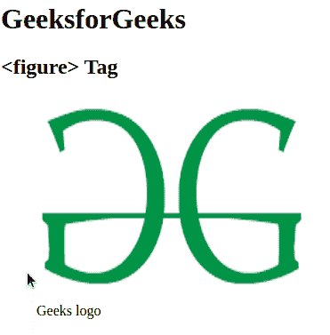

# HTML5 图标签

> 原文:[https://www.geeksforgeeks.org/html5-figure-tag/](https://www.geeksforgeeks.org/html5-figure-tag/)

HTML 中的

<figure>标签用于添加独立的内容，如文档中的插图、图表、照片或代码列表。它与主流程相关，但它可以在文档的任何位置使用，并且图形与文档的流程一致，如果将其删除，则不应影响文档的流程。这个标签在 HTML5 中是新的。
</figure>

**语法:**

```html
<figure> Image content... </figure>
```

**属性:**主要包含两个标签，如下所示:

*   [**img src**](https://www.geeksforgeeks.org/html-img-src-attribute/) **:** 此标签用于在文档中添加图像源。
*   [**fig caption**](https://www.geeksforgeeks.org/html5-figcaption-tag/)**:**此标签用于设置图像的字幕。

**例:**

## 超文本标记语言

```html
<!DOCTYPE html>

<html>

    <body>

        <h1>GeeksforGeeks</h1>
        <h2><figure> Tag</h2>
        <!--HTML figure tag starts here-->
        <figure>
            
            <figcaption>Geeks logo</figcaption>
        </figure>
        <!--HTML figure tag ends here-->

    </body>

</html>                   
```

**输出:**



**支持的浏览器:**

*   谷歌 Chrome 6.0
*   Edge 9.0
*   Firefox 4.0
*   Safari 5.0
*   歌剧 11.1