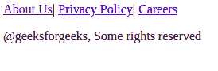
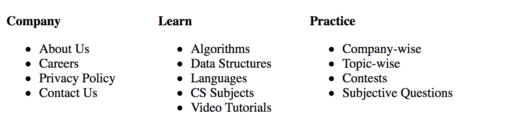

# HTML5

<footer>标签</footer>

> 原文:[https://www.geeksforgeeks.org/html5-footer-tag/](https://www.geeksforgeeks.org/html5-footer-tag/)

HTML 中的

<footer>标记用于定义 HTML 文档的页脚。此部分包含页脚信息(作者信息、版权信息、载体等)。页脚标签用在正文标签中。

<footer>标签在 HTML5 中是新的。页脚元素需要一个开始标记和一个结束标记。
</footer>

</footer>

**语法:**

```html
<footer> ... </footer>
```

页脚元素通常包含作者信息、版权信息、联系信息、站点地图、从头到尾链接、相关文档等。

以下示例说明了 HTML 元素中的

<footer>标签:
</footer>

**例 1:**

## 超文本标记语言

```html
<!DOCTYPE html>

<html>

    <body>
        <!--HTML footer tag starts here-->
        <footer>

                    <a href=
"https://www.geeksforgeeks.org/about/">About Us</a>|
                    <a href=
"https://www.geeksforgeeks.org/privacy-policy/">Privacy Policy</a>|
                    <a href=
"https://www.geeksforgeeks.org/careers/">Careers</a>

<p>@geeksforgeeks, Some rights reserved</p>

        </footer>
        <!--HTML figcaption tag ends here-->
    </body>

</html>                   
```

**输出:**



**示例 2:** 在页脚标签中使用 CSS

## 超文本标记语言

```html
<!DOCTYPE html>
<html>
    <head>
        <title>footer tag</title>
        <style>
            .column {
                float: left;
                width: 27%;
               height: 300px;
            }
            p {
                font-size:20px;
                font-weight:bold;
            }
        </style>
    </head>
    <body>
        <!--HTML footer tag starts here-->
        <footer>
            <div class="column">

<p>Company</p>

                <ul style="list-style-type:disc">
                    <li>About Us</li>
                    <li>Careers</li>
                    <li>Privacy Policy</li>
                    <li>Contact Us</li>
                </ul>
            </div>

            <div class="column">

<p>Learn</p>

                <ul>
                    <li>Algorithms</li>
                    <li>Data Structures</li>
                    <li>Languages</li>
                    <li>CS Subjects</li>
                    <li>Video Tutorials</li>
                </ul>
            </div>

            <div class="column">

<p>Practice</p>

                <ul>
                    <li>Company-wise</li>
                    <li>Topic-wise</li>
                    <li>Contests</li>
                    <li>Subjective Questions</li>
                </ul>
            </div>
        </footer>
        <!--HTML figcaption tag ends here-->
    </body>
</html>
```

**输出:**



**支持的浏览器:**

*   谷歌 Chrome 6.0
*   Internet Explorer 9.0
*   Firefox 4.0
*   歌剧 11.1
*   Safari 5.0