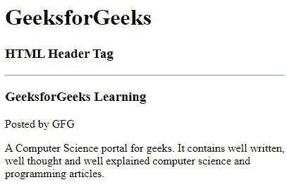
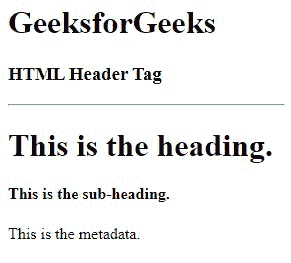
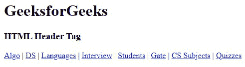

# HTML5

<header>标签</header>

> 原文:[https://www.geeksforgeeks.org/html5-header-tag/](https://www.geeksforgeeks.org/html5-header-tag/)

**示例:**该示例说明了<标题>标签的使用，该标签构成了文档标题部分的容器。

## 超文本标记语言

```html
<!DOCTYPE html>
<html>
<body>
    <h1>GeeksforGeeks</h1>
    <h3>HTML Header Tag</h3>
    <hr>
    <article>
        <header>
            <h3>GeeksforGeeks Learning</h3>
            <p>Posted by GFG</p>

            <p>A Computer Science portal for geeks. It contains well written,
               well thought and well explained computer science and
               programming articles.
            </p>

        </header>
    </article>
</body>
</html>
```

**输出:**



HTML 中的

<header>标签用于定义文档或章节的标题，因为它包含与相关内容的标题和标题相关的信息。

<header>元素通常包含该部分的标题(h1-h6 元素或

<hgroup>元素)，但这不是必需的。它还可以用来包装一个部分的目录、搜索表单或任何相关的徽标。

<header>标签是 HTML5 中的一个新标签，是一个容器标签 ie。，它包含一个开始标记、内容和结束标记。一个文档中可以有多个

<header>元素。该标签不能放在一个

<footer>、

<address>或另一个

<header>元素中。</header>

</address>

</footer>

</header>

</header>

</hgroup>

</header>

</header>

**语法:**

```html
<header> ...</header>
```

**属性**:这个标签支持 HTML 中所有的[全局属性](https://www.geeksforgeeks.org/html-global-attributes/)。

下面的例子说明了 HTML 中的

<header>元素。</header>

**示例 1:** 在本例中，我们使用了<标题>标签来包含周围部分的标题，但并不是每次都需要。

## 超文本标记语言

```html
<!DOCTYPE html>
<html>
<body>
    <h1>GeeksforGeeks</h1>
    <h3>HTML Header Tag</h3>

    <!--HTML header tag starts here-->
    <header>
        <h1>This is the heading.</h1>
        <h4>This is the sub-heading.</h4>
        <p>This is the metadata.</p>

    </header>
    <!--HTML header tag ends here-->
</body>
</html>
```

**输出:**



**示例 2:** 在本例中，我们使用了<标题>标签来表示导航辅助工具。

## 超文本标记语言

```html
<!DOCTYPE html>
<html>
<body>
    <h1>GeeksforGeeks</h1>
    <h3>HTML Header Tag</h3>

    <!--HTML header tag starts here-->
    <header> 
        <a href=
"https://www.geeksforgeeks.org/fundamentals-of-algorithms/">
        Algo</a> | 
        <a href=
"https://www.geeksforgeeks.org/data-structures/">
        DS</a> | 
        <a href=
"https://www.geeksforgeeks.org/category/program-output/">
        Languages</a> | 
        <a href=
"https://www.geeksforgeeks.org/company-interview-corner/">
        Interview</a> | 
        <a href=
"https://www.geeksforgeeks.org/student-corner/">
        Students</a> | 
        <a href=
"https://www.geeksforgeeks.org/gate-cs-notes-gq/">
        Gate</a> | 
        <a href=
"https://www.geeksforgeeks.org/articles-on-computer-science-subjects-gq/">
        CS Subjects</a> | 
        <a href=
"https://www.geeksforgeeks.org/quiz-corner-gq/">
        Quizzes</a> 
    </header>
    <!--HTML header tag ends here-->
</body>
</html>
```

**输出:**



**支持的浏览器:**

*   谷歌 Chrome 93.0 及以上
*   Internet Explorer 11.0
*   微软边缘 93.0
*   火狐 92.0 及以上版本
*   Opera 79.0
*   Safari 14.1

HTML 是网页的基础，通过构建网站和网络应用程序用于网页开发。您可以通过以下 [HTML 教程](https://www.geeksforgeeks.org/html-tutorials/)和 [HTML 示例](https://www.geeksforgeeks.org/html-examples/)从头开始学习 HTML。