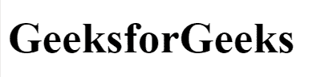
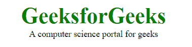

# HTML5 |简介

> 原文:[https://www.geeksforgeeks.org/html5-introduction/](https://www.geeksforgeeks.org/html5-introduction/)

**简介:** HTML 代表超文本标记语言。它用于使用标记语言设计网页。HTML 是超文本和标记语言的结合。超文本定义了网页之间的链接。标记语言用于定义标签内的文本文档，标签定义网页的结构。HTML 5 是 HTML 的第五个也是目前的版本。它改进了文档可用的标记，并引入了应用程序编程接口和文档对象模型。

**特征:**

*   它引入了新的多媒体功能，通过使用

    <audio>和<video>标签支持音频和视频控制。</video></audio>

*   有新的图形元素，包括矢量图形和标签。
*   通过加入

    <header>

    <footer>

    <article>

    <section>

    <figure>来丰富语义内容。</figure>

    </section>

    </article>

    </footer>

    </header>

*   拖放-用户可以抓取一个对象，并将其进一步拖放到新的位置。
*   地理定位服务-它有助于定位客户的地理位置。
*   网络存储设备，提供在网络浏览器上存储数据的网络应用方法。
*   使用 SQL 数据库脱机存储数据。
*   允许绘制各种形状，如三角形、矩形、圆形等。
*   能够处理不正确的语法。
*   简易 DOCTYPE 声明，即
*   简单字符编码，即

**从 HTML 5 中删除的元素:**从 HTML 5 中折旧的元素有很多，如下所示:

| 移除的元素 | 使用替代元素 |
| --- | --- |
|  |  |
|  |  |
| <basefont> | 半铸钢ˌ钢性铸铁(Cast Semi-Steel) |
|  | 半铸钢ˌ钢性铸铁(Cast Semi-Steel) |
|  | 半铸钢ˌ钢性铸铁(Cast Semi-Steel) |
|  |  |
|  | 半铸钢ˌ钢性铸铁(Cast Semi-Steel) |
|  |  |
|  |  |
| 

<noframes></noframes>

 |  |
| 

<form>

* * *

<label>This is a searchable index. Enter search keywords: <input name="isindex"></label>

* * *

</form>

 |  |
|  | CSS、~~或~~ |
|  | 半铸钢ˌ钢性铸铁(Cast Semi-Steel) |

**HTML 5 中新增元素:**

*   **<文章>:**<文章>标签用来表示一篇文章。更具体地说，<文章>标签中的内容独立于网站的其他内容(即使它可以是相关的)。
*   **<旁> :** 旁<旁>标签用于像荧光笔一样用较短的方式描述网页的主要对象。它基本上识别与网页的主要内容相关的内容，但不构成主要页面的主要意图。一旁的<>标签主要包含作者信息、链接、相关内容等。
*   **<图形标题>:**HTML 中的<图形标题>标签用于为文档中的图形元素设置标题。
*   **<图>:**HTML 中的<图>标签用于添加独立的内容，如文档中的插图、图表、照片或代码列表。它与主流程相关，但它可以在文档的任何位置使用，并且图形与文档的流程一致，如果删除它，则不应影响文档的流程。
*   **<标题> :** 包含章节标题以及其他内容，如导航链接、目录等。
*   **<页脚>:**HTML 中的<页脚>标签用于定义 HTML 文档的页脚。此部分包含页脚信息(作者信息、版权信息、载体等)。页脚标记用在正文标记中。<页脚>标签在 HTML 5 中是新的。页脚元素需要一个开始标记和一个结束标记。
*   **< main > :** 描绘文档或 web 应用程序正文的主要内容。
*   **<标记>:**HTML 中的<标记>标记用于定义标记的文本。它用于突出段落中的文本部分。
*   **<导航>:**<导航>标签用于在 HTML 文档中声明导航部分。网站通常有专门用于导航链接的部分，这使用户能够导航网站。这些链接可以放在导航标签里面。
*   **<部分> :** 划分内容的主题分组。
*   **<详细信息>:**<详细信息>标签用于最初隐藏的内容/信息，但如果用户希望查看，可以显示该内容/信息。该标签用于创建用户可以打开或关闭的交互式小部件。打开设置属性时，详细信息标签的内容可见。
*   **<摘要>:**HTML 中的<摘要>标签用于定义<细节>元素的摘要。<摘要>元素与<细节>元素一起使用，并提供用户可见的摘要。当用户点击摘要时，放置在<细节>元素中的内容变得可见，而之前是隐藏的。HTMl 5 中增加了<摘要>标签。<总结>标签需要开始和结束标签。
*   **<时间>:**<时间>标签用于显示人类可读的数据/时间。它还可以用来以机器可读的形式对日期和时间进行编码。用户的主要优势是，他们可以在日历中添加生日提醒或预定活动，搜索引擎可以生成更智能的搜索结果。
*   **<BDI>:**<BDI>标签是指双向隔离。它将文本与可能以不同方向格式化的其他文本区分开来。当用户生成方向未知的文本时，使用该标签。
*   **<wbr>:**HTML 中的< wbr >标记代表断字机会，用于定义文本中被浏览器视为换行符的位置。当使用的单词太长，浏览器可能会在不适合文本的地方换行时，通常会用到它。
*   **<数据列表>:**<数据列表>标签用于在 HTML 文件中提供自动完成功能。它可以与输入标签一起使用，因此用户可以使用 select 数据轻松地填写表单中的数据。
*   **<key gen>:**HTML 中的< keygen >标记用于在表单中指定密钥对生成器字段。< keygen >元素的目的是提供一种安全的方式来认证用户。当提交一个 from 时，会生成两个密钥，私钥和公钥。私钥存储在本地，公钥发送到服务器。公钥用于生成客户端证书，以便将来对用户进行身份验证。
*   **<输出>:**HTML 中的<输出>标记用于表示客户端脚本(如 JavaScript)执行的计算结果。
*   **<进度> :** 用来表示一个任务的进度。它还定义了做了多少工作，还有多少剩余来下载一个东西。它不用于表示磁盘空间或相关查询。
*   **< svg > :** 是可伸缩矢量图形。
*   **<画布>:**HTML 中的<画布>标签用于使用 JavaScript 在网页上绘制图形。它可以用来绘制路径、方框、文本、渐变和添加图像。默认情况下，它不包含边框和文本。
*   **<音频> :** 定义音乐或音频内容。
*   **<嵌入> :** 定义外部应用程序(通常是视频播放器)的容器。
*   **<来源> :** 定义了<视频>和<音频>的来源。
*   **<轨道> :** 定义了<视频>和<音频>的轨道。
*   **<视频> :** 定义视频内容。

**优势:**

*   支持所有浏览器。
*   更友好的设备。
*   易于使用和实施。
*   HTML 5 与 CSS、JavaScript 等的集成可以帮助构建漂亮的网站。

**缺点:**

*   必须编写长代码，这很耗时。
*   只有现代浏览器支持它。

**支持的浏览器:**所有现代浏览器都支持。

下面的例子说明了 HTML 5 的内容。
**例 1:**

```html
<!DOCTYPE html> 
<html> 

<head> 
    <title>HTML 5</title> 
    <style> 
        h1 { 
            font-size:50px; 
        } 
    </style> 
</head> 

<body> 
    <h1>GeeksforGeeks</h1> 
</body> 

</html>                    
```

**输出:**


**例 2:**

```html
<!DOCTYPE html>
<html> 

<head> 
    <title>HTML 5 Demo</title> 

    <style> 
        .GFG { 
            font-size:40px; 
            font-weight:bold;
            color:green;
        } 
        body {
            text-align:center;
        }
    </style> 
</head> 

<body> 
    <div class = "GFG">GeeksforGeeks</div> 
    <aside> 
        <div>A computer science portal for geeks</div> 
    </aside> 
</body> 

</html>                    
```

**输出:**
