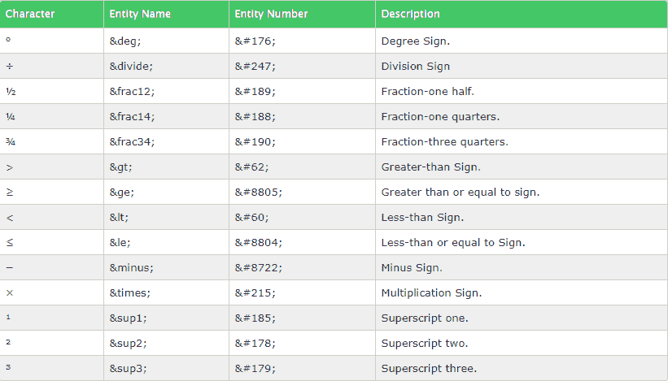
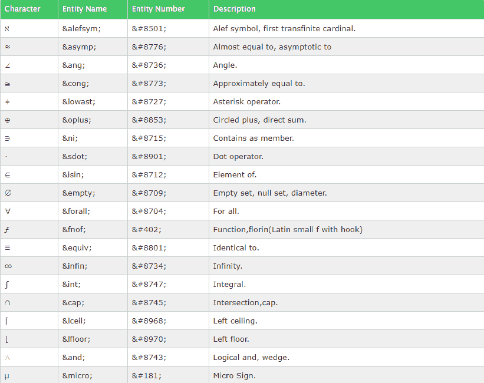

# HTML5 |数学运算符

> 原文:[https://www.geeksforgeeks.org/html5-mathematical-operators/](https://www.geeksforgeeks.org/html5-mathematical-operators/)

数学运算符用于表示数学和技术运算符。在 HTML5 中，使用了一些特殊的代码。对于这些运算符的表示，我们可以使用名称或十六进制(十六进制)引用。

示例:

```html
Input : &minus or &#8722 
Output : -
Input : &times or &#215
Output : x
Input : &frac34 or &#190
Output : 3/4

```

```html
<!DOCTYPE html>
<html>
<body>

  <p>∑</p>
  <p>>&#8721</p>
  <p>°</p>
  <p>>&#176</p>
  <p>≈</p> 
  <p>>&#8776</p>
</body>
</html>
```

输出:

在 html 代码中编写十六进制引用时，末尾需要一个分号。
一些常见的数学符号是-

一些复杂的数学符号是-
