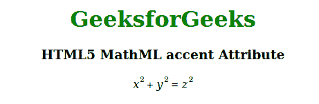

# HTML5 MathML 重音属性

> 原文:[https://www . geesforgeks . org/html 5-mathml-重音-属性/](https://www.geeksforgeeks.org/html5-mathml-accent-attribute/)

HTML5 中的 **MathML** **重音**属性用于指定是否应将运算符视为重音。该属性的可能值为真或假。该属性可以与[<mo>](https://www.geeksforgeeks.org/html5-mathml-mo-tag/)[<Mover>](https://www.geeksforgeeks.org/html5-mathml-mover-tag/)和[<munderover>](https://www.geeksforgeeks.org/html5-mathml-munderover-tag/)MathML 标签一起使用。

**语法:**

```html
<element accent="true | false">

```

**属性值:**该属性有两个值，如上所述，描述如下:

*   **true:** 该值表示应将操作符视为重音。
*   **false:** 该值表示不应将运算符视为重音。

以下示例说明了 **MathML 重音**属性:

**示例:**

## 超文本标记语言

```html
<!DOCTYPE html>
<html>

<body style="text-align:center;">

    <h1 style="color:green">
        GeeksforGeeks
    </h1>

    <h3>
        HTML5 MathML accent Attribute
    </h3>

    <math>
        <mrow>
            <mrow>
                <msup>
                    <mi>x</mi>
                    <mn>2</mn>
                </msup>
                <mo accent="true">+</mo>
                <msup>
                    <mi>y</mi>
                    <mn>2</mn>
                </msup>
            </mrow>
            <mo accent="true">=</mo>
            <msup>
                <mi>z</mi>
                <mn>2</mn>
            </msup>
        </mrow>
    </math>
</body>

</html>
```

**输出:**



**支持的浏览器:****html 5 MathML 重音**属性支持的浏览器如下:

*   火狐浏览器