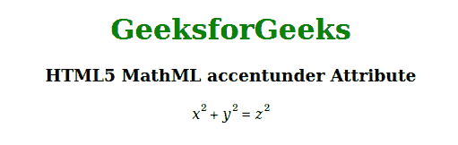

# HTML5 MathML 重音属性

> 原文:[https://www . geesforgeks . org/html 5-mathml-重音-属性/](https://www.geeksforgeeks.org/html5-mathml-accentunder-attribute/)

属性下的 **MathML** **重音用于指定元素是否被视为重音。值**为真**意味着重音被画得更接近基本表达式，值**为假**意味着取而代之的是一个限制。两者的区别在于，限制的大小减小了，而重音的大小与基音相同。**

**语法:**

```html
<element accentunder="true | false">
```

**属性值:**该属性有两个值，如上所述，描述如下:

*   **true:** 该值意味着元素被视为更接近基本表达式的重音。
*   **false:** 该值表示该元素被视为极限。

以下示例说明了属性下的 **MathML 重音:**

**示例:**

## 超文本标记语言

```html
<!DOCTYPE html>
<html>

<body style="text-align:center;">

    <h1 style="color:green">
        GeeksforGeeks
    </h1>

    <h3>
        HTML5 MathML accentunder Attribute
    </h3>

    <math>
        <mrow>
            <mrow>
                <msup>
                    <mi>x</mi>
                    <mn>2</mn>
                </msup>
                <mo accentunder="true">+</mo>
                <msup>
                    <mi>y</mi>
                    <mn>2</mn>
                </msup>
            </mrow>
            <mo accentunder="false">=</mo>
            <msup>
                <mi>z</mi>
                <mn>2</mn>
            </msup>
        </mrow>
    </math>
</body>

</html>
```

**输出:**



**支持的浏览器:**html 5**支持的浏览器**属性下的 MathML 重音如下:

*   火狐浏览器