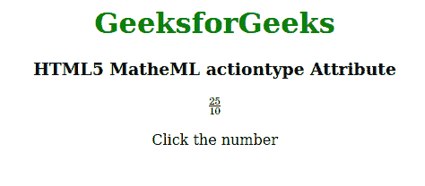

# HTML5 MathML 动作类型属性

> 原文:[https://www . geesforgeks . org/html 5-mathml-action type-attribute/](https://www.geeksforgeeks.org/html5-mathml-actiontype-attribute/)

该属性包含三种类型的动作**状态**、**切换**和**工具提示**，它们的行为各不相同。该属性仅被 [<标记>](https://www.geeksforgeeks.org/html5-mathml-maction-tag/) 接受。

**语法:**

```html
<element accentunder="statusline|toggle|tooltip">

```

**属性值:**

*   **状态行:**该属性通过状态行显示计算值。
*   **切换:**该属性切换计算值。
*   **工具提示:**该属性弹出计算值。

下面的例子说明了 HTML5 中的 actiontype 属性:

## 超文本标记语言

```html
<!DOCTYPE html>
<html>

<head>
    <title>HTML5 actiontype Attribute</title>
</head>

<body>
    <center>
        <h1 style="color:green">GeeksforGeeks</h1>
        <h3>HTML5 MatheML actiontype Attribute</h3>
        <math>
            <maction actiontype="toggle">
                <mfrac>
                    <mn>25</mn>
                    <mn>10</mn>
                </mfrac>
                <mfrac>
                    <mrow>
                        <mn>5</mn>
                        <mo>⋅</mo>
                        <mn>5</mn>
                    </mrow>
                    <mrow>
                        <mn>2</mn>
                        <mo>⋅</mo>
                        <mn>5</mn>
                    </mrow>
                </mfrac>
                <mfrac>
                    <mn>5</mn>
                    <mn>2</mn>
                </mfrac>
            </maction>
        </math>
        <p>Click the number</p>
    </center>
</body>

</html>
```

**输出:**



**支持的浏览器:**html 5 MathML**action type****属性**支持的浏览器如下:

*   火狐浏览器