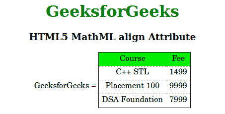

# HTML5 MathML 对齐属性

> 原文:[https://www.geeksforgeeks.org/html5-mathml-align-attribute/](https://www.geeksforgeeks.org/html5-mathml-align-attribute/)

该属性保存表的对齐方式。可能的值有轴、基线、底部、中心和顶部。这个属性可以被很多标签接受，比如[<>](https://www.geeksforgeeks.org/html5-mathml-mtable-tag/)[<munder>](https://www.geeksforgeeks.org/html5-mathml-munder-tag/)[<Mover>T5](https://www.geeksforgeeks.org/html5-mathml-mover-tag/)[和< munderover >](https://www.geeksforgeeks.org/html5-mathml-munderover-tag/) 标签。

**语法:**

```html
<element align="axis|baseline|bottom|center|top">

```

**属性值:**

*   **轴:**该属性定义表格接受的整数的行对齐。
*   **基线:**该属性设置基线时表格的对齐方式。
*   **底部:**该属性设置表格在底部的对齐方式。
*   **中心:**该属性设置表格在中心的对齐方式。
*   **顶部:**该属性设置表格在顶部的对齐方式。

以下示例说明了**对齐**属性:

## 超文本标记语言

```html
<!DOCTYPE html> 
<html> 

<head> 
    <title>HTML5 MathML align Attribute</title> 
</head> 

<body> 
    <center> 
        <h1 style="color:green"> 
            GeeksforGeeks 
        </h1> 

        <h3>HTML5 MathML align Attribute</h3> 

        <math> 
            <mi>GeeksforGeeks</mi> 
            <mo>=</mo> 
            <mtable frame="solid" 
                rowlines="dashed" align="axis 3"> 

                <mtr mathbackground="green;"> 
                    <mtd>Course</mtd> 
                    <mtd>Fee</mtd> 
                </mtr> 
                <mtr> 
                    <mtd> 
                        <mi>C++ STL</mi> 
                    </mtd> 
                    <mtd> 
                        <mi> 1499</mi> 
                    </mtd> 
                </mtr> 
                <mtr> 
                    <mtd> 
                        <mi>Placement 100 </mi> 
                    </mtd> 
                    <mtd> 
                        <mi>9999 </mi> 
                    </mtd> 
                </mtr> 
                <mtr> 
                    <mtd> 
                        <mi>DSA Foundation </mi> 
                    </mtd> 
                    <mtd> 
                        <mi>7999</mi> 
                    </mtd> 
                </mtr> 
            </mtable> 
        </math> 
    </center> 
</body> 

</html> 
```

**输出:**



**支持的浏览器:**html 5 MathML**对齐** **属性**支持的浏览器如下:

*   火狐浏览器