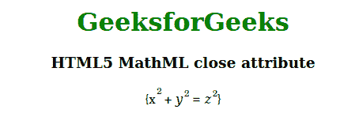

# HTML5 MathML 关闭属性

> 原文:[https://www.geeksforgeeks.org/html5-mathml-close-attribute/](https://www.geeksforgeeks.org/html5-mathml-close-attribute/)

该属性保存任何等式的右括号，与*打开*属性相同。这个属性被 [<的>](https://www.geeksforgeeks.org/html5-mathml-mfenched-tag/) 标签所接受。

**语法:**

```html
<element close="parentheses">

```

**属性值:**

*   **括号:**它包含将用于关闭任何等式的括号。

**示例:**下面的示例说明了 HTML5 MathML 中的*关闭*属性。

## 超文本标记语言

```html
<!DOCTYPE html> 
<html> 

<body> 
    <center> 
        <h1 style="color:green"> 
            GeeksforGeeks 
        </h1> 

        <h3>HTML5 MathML close attribute</h3> 

        <math> 
            <mfenced open="{" close="}" separators=""> 
                <mrow> 
                    <msup> 
                        <mi>x</mi> 
                        <mn>2</mn> 
                    </msup> 
                    <mo>+</mo> 
                    <msup> 
                        <mi>y</mi> 
                        <mn>2</mn> 
                    </msup> 
                    <mo>=</mo> 
                    <msup> 
                        <mi>z</mi> 
                        <mn>2</mn> 
                    </msup> 
                </mrow> 
            </mfenched> 
        </math> 
    </center> 
</body> 

</html> 
```

**输出:**



**支持的浏览器:**html 5 MathML*关闭*属性支持的浏览器如下。

*   火狐浏览器