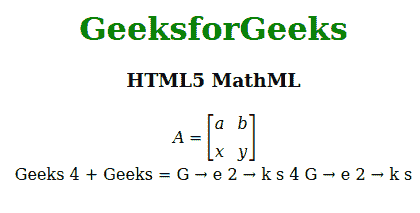

# HTML5 | MathML 完全参考

> 原文:[https://www . geesforgeks . org/html 5-mathml-complete-reference/](https://www.geeksforgeeks.org/html5-mathml-complete-reference/)

[**MathML**](https://www.geeksforgeeks.org/html5-mathml-introduction/?ref=rp) 在 HTML5 中出现目前的 MathML 版本是 3 它是在 2015 年推出的。MathML 代表数学标记语言。它像其他 HTML 元素一样，用于在网络浏览器中表示数学等式或表达式。MathML 用于描述数学，作为机器对机器通信的基础，它旨在由专门的创作工具处理，如方程编辑器，它对其他应用程序也有意义。

**示例:**

```html
<!DOCTYPE html> 
<html> 

<head> 
    <title>HTML5 MathML</title> 
</head> 

<body style="text-align:center;"> 

    <h1 style="color:green"> 
        GeeksforGeeks 
    </h1> 

    <h3>HTML5 MathML</h3> 

    <!--start tag of the whole representation-->
    <math> 

        <!-- Creating Matrix -->
        <mrow> 
            <mi>A</mi> 
            <mo>=</mo> 

            <mfenced open="[" close="]"> 

                <mtable> 
                    <mtr> 
                        <mtd> 
                            <mi>a</mi> 
                        </mtd> 
                        <mtd> 
                            <mi>b</mi> 
                        </mtd> 
                    </mtr> 

                    <mtr> 
                        <mtd> 
                            <mi>x</mi> 
                        </mtd> 
                        <mtd> 
                            <mi>y</mi> 
                        </mtd> 
                    </mtr> 

                </mtable> 

            </mfenced> 
        </mrow> 

        <!-- Creating equation -->
        <br><br> 
        <msub> 
            <mi>Geeks</mi> 
            <mn>4</mn> 
        </msub> 
        <mo>+</mo> 
        <mn>Geeks</mn> 
        <mo>=</mo> 
        <msub> 
            <mi>G</mi> 
        </msub> 
        <mo>→</mo> 
        <msub> 
            <mi>e</mi> 
            <mn>2</mn> 
        </msub> 
        <mo>→</mo> 
        <mi>k</mi> 
        <mi>s</mi> 
        <mn>4 
        </mn> 
        <msub> 
            <mi>G</mi> 
        </msub> 
        <mo>→</mo> 
        <msub> 
            <mi>e</mi> 
            <mn>2</mn> 
        </msub> 
        <mo>→</mo> 
        <mi>k</mi> 
        <mi>s</mi> 
    </math> 
</body> 

</html> 
```

**输出:**



**完整参考:**

*   [HTML5 | MathML 简介](https://www.geeksforgeeks.org/html5-mathml-introduction/?ref=rp)
*   [MathML <数学>标签](https://www.geeksforgeeks.org/html5-mathml-math-tag/)
*   math ml<maction>天
*   [MathML <菜单关闭>标签](https://www.geeksforgeeks.org/html5-mathml-menclose-tag/)
*   [mathml<mererror>天](https://www.geeksforgeeks.org/html5-mathml-merror-tag/)
*   [MathML <内嵌>标签](https://www.geeksforgeeks.org/html5-mathml-mfenched-tag/)
*   [MathML < mfrac >日](https://www.geeksforgeeks.org/html5-mathml-mfrac-tag/)
*   [MathML < mglyph >日](https://www.geeksforgeeks.org/html5-mathml-mglyph-tag/)
*   [MathML < mi >标签](https://www.geeksforgeeks.org/html5-mathml-mi-tag/)
*   [mathml<mlbeledr>日](https://www.geeksforgeeks.org/html5-mathml-mlabeledtr-tag/)
*   [MathML <免疫脚本>标签](https://www.geeksforgeeks.org/html5-mathml-mmultiscripts-tag/)
*   [MathML < mn >标签](https://www.geeksforgeeks.org/html5-mathml-mn-tag/)
*   [MathML < mo >标签](https://www.geeksforgeeks.org/html5-mathml-mo-tag/)
*   [MathML <推进器>标签](https://www.geeksforgeeks.org/html5-mathml-mover-tag/)
*   [MathML <添加了>标签](https://www.geeksforgeeks.org/html5-mathml-mpadded-tag/)
*   [MathML < mphantom >标签](https://www.geeksforgeeks.org/html5-mathml-mphantom-tag/)
*   [mathml<mrboot>天](https://www.geeksforgeeks.org/html5-mathml-mroot-tag/)
*   [MathML < mrow >天](https://www.geeksforgeeks.org/html5-mathml-mrow-tag/)
*   [MathML < ms >标签](https://www.geeksforgeeks.org/html5-mathml-ms-tag/)
*   [MathML < mspace >标签](https://www.geeksforgeeks.org/html5-mathml-mspace-tag/)
*   [MathML < msqrt >天](https://www.geeksforgeeks.org/html5-mathml-msqrt-tag/)
*   [MathML <风格>标签](https://www.geeksforgeeks.org/html5-mathml-style-tag/)
*   math ml<msub>天
*   [mathml<mssubup>天](https://www.geeksforgeeks.org/html5-mathml-msubsup-tag/)
*   math ml<msup>天
*   [MathML < mtable >标签](https://www.geeksforgeeks.org/html5-mathml-mtable-tag/)
*   [MathML < mtd >天](https://www.geeksforgeeks.org/html5-mathml-mtd-tag/)
*   [MathML <多行文字>标记](https://www.geeksforgeeks.org/html5-mathml-mtext-tag/)
*   [MathML <地铁>标签](https://www.geeksforgeeks.org/html5-mathml-mtr-tag/)
*   [MathML < mth >天](https://www.geeksforgeeks.org/html5-mathml-mth-tag/)
*   [MathML <口>标签](https://www.geeksforgeeks.org/html5-mathml-munder-tag/)
*   [mathml<munder>标签](https://www.geeksforgeeks.org/html5-mathml-munderover-tag/)
*   [MathML <语义>标签](https://www.geeksforgeeks.org/html5-mathml-semantics-tag/)T2】