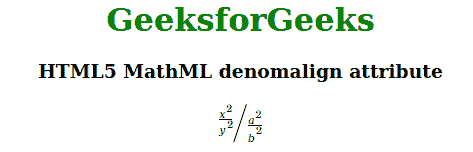

# HTML5 MathML 去恶性属性

> 原文:[https://www . geeksforgeeks . org/html 5-mathml-denomalli-attribute/](https://www.geeksforgeeks.org/html5-mathml-denomalign-attribute/)

该属性保存分母的对齐值，可能的值是左、中、右。该属性仅被<mfrac>标签接受。</mfrac>

**语法:**

```html
<element denomalign="left|right|center">

```

**属性值:**

*   **左侧:**该属性设置每行分母上下文向左对齐。
*   **右侧:**该属性将每行分母上下文的对齐方式设置为右侧。
*   **中心:**该属性设置每行分母上下文向中心对齐。

下面的例子说明了 HTML5 MathML 中的分母属性:

**示例:**

## 超文本标记语言

```html
<!DOCTYPE html> 
<html> 

<head> 
    <title>HTML5 MathML denomalign attribute</title> 
</head> 

<body> 
    <center> 
        <h1 style="color:green"> 
            GeeksforGeeks 
        </h1> 

        <h3>HTML5 MathML denomalign attribute</h3> 

        <math> 
            <mfrac bevelled="true" denomalign="left" > 
                <mfrac> 
                    <msup> 
                        <mi>x</mi> 
                        <mn>2</mn> 
                    </msup> 
                    <msup> 
                        <mi>y</mi> 
                        <mn>2</mn> 
                    </msup> 
                </mfrac> 
                <mfrac> 
                    <msup> 
                        <mi>a</mi> 
                        <mn>2</mn> 
                    </msup> 
                    <msup> 
                        <mi>b</mi> 
                        <mn>2</mn> 
                    </msup> 
                </mfrac> 
            </mfrac> 
        </math> 
    </center> 
</body> 

</html>
```

**输出:**



**支持的浏览器:**html 5 MathML 去恶性属性支持的浏览器如下:

*   火狐浏览器