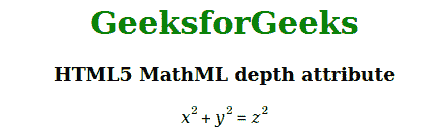

# HTML5 MathML 深度属性

> 原文:[https://www.geeksforgeeks.org/html5-mathml-depth-attribute/](https://www.geeksforgeeks.org/html5-mathml-depth-attribute/)

该属性用于设置深度或增加/减少内容的深度。该属性仅被<mpadded>标签接受。</mpadded>

**语法:**

```html
<element depth="length">

```

**属性值:**

*   **长度:**该属性设置或增加深度。

以下示例说明了 HTML5 MathML 中的深度属性:

**示例:**

## 超文本标记语言

```html
<!DOCTYPE html> 
<html> 

<head> 
    <title>HTML5 MathML depth attribute</title> 
</head> 

<body style="text-align:center;"> 

    <h1 style="color:green"> 
        GeeksforGeeks 
    </h1> 

    <h3>HTML5 MathML depth attribute</h3> 

    <math> 
        <mpadded depth="20"> 
            <mrow> 
                <mrow> 
                    <msup> 
                        <mi>x</mi> 
                        <mn>2</mn> 
                    </msup> 
                    <mo>+</mo> 
                    <msup> 
                        <mi>y</mi> 
                        <mn>2</mn> 
                    </msup> 
                </mrow> 
                <mo>=</mo> 
                <msup> 
                    <mi>z</mi> 
                    <mn>2</mn> 
                </msup> 
            </mrow> 
        </mpadded> 
    </math> 
</body> 

</html>
```

**输出:**



**支持的浏览器:**html 5 MathML 深度属性支持的浏览器如下:

*   火狐浏览器