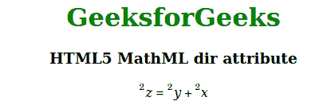

# HTML5 MathML 目录属性

> 原文:[https://www.geeksforgeeks.org/html5-mathml-dir-attribute/](https://www.geeksforgeeks.org/html5-mathml-dir-attribute/)

该属性保存方向值。它保存两种类型的方向值，从左到右为 ltr，从右到左为 rtl。该属性被 [<数学>](https://www.geeksforgeeks.org/html5-mathml-math-tag/) 、 [< mi >](https://www.geeksforgeeks.org/html5-mathml-mi-tag/) 、 [< mo >](https://www.geeksforgeeks.org/html5-mathml-mo-tag/) 、 [< mrow >](https://www.geeksforgeeks.org/html5-mathml-mrow-tag/) 、 [< ms >](https://www.geeksforgeeks.org/html5-mathml-ms-tag/) ，以及 [< mtext >](https://www.geeksforgeeks.org/html5-mathml-mtext-tag/) 接受。

**语法:**

```html
<element dir="ltr|rtl">

```

**属性值:**

*   **ltr:** 该值保持从左到右的方向。
*   **rtl:** 该值保持从右向左的方向。

下面的例子说明了 HTML5 中的 dir 属性:

**示例:**

## 超文本标记语言

```html
<!DOCTYPE html> 
<html> 

<head> 
    <title>HTML5 MathML dir attribute</title> 
</head> 

<body> 
    <center> 
        <h1 style="color:green"> 
            GeeksforGeeks 
        </h1> 

        <h3>HTML5 MathML dir attribute</h3> 

        <math dir="rtl"> 
            <mrow> 
                <mrow> 
                    <msup> 
                        <mi>x</mi> 
                        <mn>2</mn> 
                    </msup> 
                    <mo>+</mo> 
                    <msup> 
                        <mi>y</mi> 
                        <mn>2</mn> 
                    </msup> 
                </mrow> 
                <mo>=</mo> 
                <msup> 
                    <mi>z</mi> 
                    <mn>2</mn> 
                </msup> 
            </mrow> 
        </math> 
    </center> 
</body> 

</html> 
```

**输出:**



**支持的浏览器:**html 5 MathML dir 属性支持的浏览器如下:

*   火狐浏览器