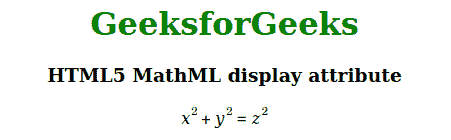

# HTML5 MathML 显示属性

> 原文:[https://www . geesforgeks . org/html 5-mathml-display-attribute/](https://www.geeksforgeeks.org/html5-mathml-display-attribute/)

这个属性保存了呈现 HTML 元素的值。可以有两个值块，这意味着该元素将显示在当前文本范围之外，内联意味着该元素将显示在当前文本范围之内。该属性仅被 [<数学>](https://www.geeksforgeeks.org/html5-mathml-math-tag/) 标签接受。

**语法:**

```html
<element display="block|inline">

```

**属性值:**

*   **块:**该值定义元素将显示在当前文本范围之外。
*   **内联:**该值定义元素将显示在当前文本范围内。

下面的例子说明了 HTML5 MathML 的显示属性:

**示例:**

## 超文本标记语言

```html
<!DOCTYPE html> 
<html> 

<head> 
    <title>HTML5 MathML display attribute</title> 
</head> 

<body> 
    <center> 
        <h1 style="color:green"> 
            GeeksforGeeks 
        </h1> 

        <h3>HTML5 MathML display attribute</h3> 

        <math display="block"> 
            <mrow> 
                <mrow> 
                    <msup> 
                        <mi>x</mi> 
                        <mn>2</mn> 
                    </msup> 
                    <mo>+</mo> 
                    <msup> 
                        <mi>y</mi> 
                        <mn>2</mn> 
                    </msup> 
                </mrow> 
                <mo>=</mo> 
                <msup> 
                    <mi>z</mi> 
                    <mn>2</mn> 
                </msup> 
            </mrow> 
        </math> 
    </center> 
</body> 

</html>
```

**输出:**



**支持的浏览器:**显示属性支持的浏览器如下:

*   火狐浏览器