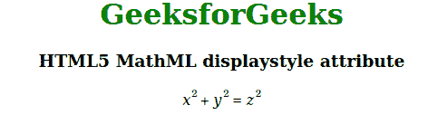

# HTML5 MathML 显示样式属性

> 原文:[https://www . geesforgeks . org/html 5-mathml-display style-attribute/](https://www.geeksforgeeks.org/html5-mathml-displaystyle-attribute/)

此属性包含一个布尔值，该值指定是否为显示的公式使用更多的垂直空间，或者如果设置为 false，是否使用更紧凑的布局来显示公式。该属性被所有 [MathML 标签](https://www.geeksforgeeks.org/html5-mathml-introduction/)接受。

**语法:**

```html
<element displaystyle="true|false">

```

**属性值:**

*   **true:** 该值定义了更多的垂直空间用于显示的方程。
*   **false:** 该值定义使用更紧凑的布局来显示公式。

下面的例子说明了 HTM5 中的 displaystyle 属性

**示例:**

## 超文本标记语言

```html
<!DOCTYPE html> 
<html> 

<head> 
    <title>HTML5 MathML displaystyle attribute</title> 
</head> 

<body> 
    <center> 
        <h1 style="color:green"> 
            GeeksforGeeks 
        </h1> 

        <h3>HTML5 MathML displaystyle attribute</h3> 

        <math displaystyle="true"> 
            <mrow> 
                <mrow> 
                    <msup> 
                        <mi>x</mi> 
                        <mn>2</mn> 
                    </msup> 
                    <mo>+</mo> 
                    <msup> 
                        <mi>y</mi> 
                        <mn>2</mn> 
                    </msup> 
                </mrow> 
                <mo>=</mo> 
                <msup> 
                    <mi>z</mi> 
                    <mn>2</mn> 
                </msup> 
            </mrow> 
        </math> 
    </center> 
</body> 

</html> 
```

**输出:**



**支持的浏览器:**display style 属性支持的浏览器如下:

*   火狐浏览器