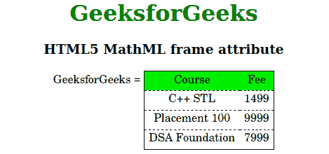

# HTML5 MathML 框架属性

> 原文:[https://www.geeksforgeeks.org/html5-mathml-frame-attribute/](https://www.geeksforgeeks.org/html5-mathml-frame-attribute/)

该属性保存整个表格的边框值。可能的值是无、实线和虚线。该属性仅被 [<可移动>](https://www.geeksforgeeks.org/html5-mathml-mtable-tag/) 标签接受。

**语法:**

```html
<element frame="none|solid|dashed">

```

**属性值:**

*   **无:**该属性将表的列行设置为无。
*   **实体:**该属性设置表格实体的列线。
*   **虚线:**该属性设置表格虚线的列线。

以下示例说明了 HTML5 中的框架属性:

**示例:**

## 超文本标记语言

```html
<!DOCTYPE html> 
<html> 

<head> 
    <title>HTML5 MathML frame attribute</title> 
</head> 

<body> 
    <center> 
        <h1 style="color:green"> 
            GeeksforGeeks 
        </h1> 

        <h3>HTML5 MathML frame attribute</h3> 

        <math> 
            <mi>GeeksforGeeks</mi> 
            <mo>=</mo> 
            <mtable frame="solid" rowlines="dashed"
                    align="axis 1"> 
                <mtr mathbackground="green;"> 
                    <mtd>Course</mtd> 
                    <mtd>Fee</mtd> 
                </mtr> 
                <mtr> 
                    <mtd> 
                        <mi>C++ STL</mi> 
                    </mtd> 
                    <mtd> 
                        <mi> 1499</mi> 
                    </mtd> 
                </mtr> 
                <mtr> 
                    <mtd> 
                        <mi>Placement 100 </mi> 
                    </mtd> 
                    <mtd> 
                        <mi>9999 </mi> 
                    </mtd> 
                </mtr> 
                <mtr> 
                    <mtd> 
                        <mi>DSA Foundation </mi> 
                    </mtd> 
                    <mtd> 
                        <mi>7999</mi> 
                    </mtd> 
                </mtr> 
            </mtable> 
        </math> 
    </center> 
</body> 

</html>
```

**输出:**



**支持的浏览器**:框架属性支持的浏览器如下:

*   火狐浏览器