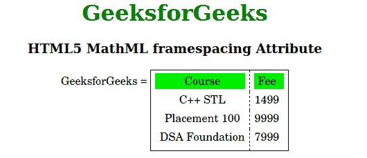

# HTML5 MathML 框架间距属性

> 原文:[https://www . geesforgeks . org/html 5-mathml-frame spacing-attribute/](https://www.geeksforgeeks.org/html5-mathml-framespacing-attribute/)

该属性定义了表格和框架之间的空间。该属性仅被 [<可移动>](https://www.geeksforgeeks.org/html5-mathml-mtable-tag/) 标签接受。

**语法:**

```html
<element framespacing="number">
```

**属性值:**

*   **编号:**此属性定义表格和框架之间的空间。

以下示例说明了 HTML5 MathML 中的框架间距属性:

**示例:**

```html
<!DOCTYPE html>
<html>

<head>
    <title>
        HTML5 MathML framespacing Attribute
    </title>
</head>

<body>
    <center>
        <h1 style="color:green">
            GeeksforGeeks
        </h1>

        <h3>HTML5 MathML framespacing Attribute</h3>

        <math>
            <mi>GeeksforGeeks</mi>
            <mo>=</mo>
            <mtable frame="solid" columnlines="dashed"
                framespacing="2" align="axis 1">

                <mtr mathbackground="green;">
                    <mtd>Course</mtd>
                    <mtd>Fee</mtd>
                </mtr>
                <mtr>
                    <mtd>
                        <mi>C++ STL</mi>
                    </mtd>
                    <mtd>
                        <mi> 1499</mi>
                    </mtd>
                </mtr>
                <mtr>
                    <mtd>
                        <mi>Placement 100 </mi>
                    </mtd>
                    <mtd>
                        <mi>9999 </mi>
                    </mtd>
                </mtr>
                <mtr>
                    <mtd>
                        <mi>DSA Foundation </mi>
                    </mtd>
                    <mtd>
                        <mi>7999</mi>
                    </mtd>
                </mtr>
            </mtable>
        </math>
    </center>
</body>

</html>
```

**输出:**



**支持的浏览器:**html 5 MathML 框架间距属性支持的浏览器如下:

*   火狐浏览器