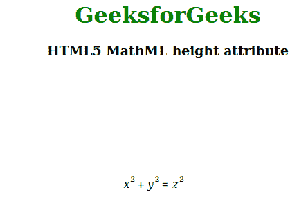

# HTML5 MathML 高度属性

> 原文:[https://www . geesforgeks . org/html 5-mathml-height-attribute/](https://www.geeksforgeeks.org/html5-mathml-height-attribute/)

此属性保存高度值长度，即基线上方的所需深度。这个属性被三个标签接受[<【mglyph】>](https://www.geeksforgeeks.org/html5-mathml-mglyph-tag/)[<>](https://www.geeksforgeeks.org/html5-mathml-mpadded-tag/)和 [< mspace >](https://www.geeksforgeeks.org/html5-mathml-mspace-tag/) 。

**语法:**

```html
<element height="length">

```

**属性值:**

*   **长度:**该属性设置或增加深度。

下面的例子说明了 HTML5 MathML 中的高度属性:

**示例:**

## 超文本标记语言

```html
<!DOCTYPE html> 
<html> 

<head> 
    <title>HTML5 MathML height attribute</title> 
</head> 

<body style="text-align:center;"> 

    <h1 style="color:green"> 
        GeeksforGeeks 
    </h1> 

    <h3>HTML5 MathML height attribute</h3> 

    <math> 
        <mpadded height="+150px" width="200px"
                    lspace="2height"> 
            <mrow> 
                <mrow> 
                    <msup> 
                        <mi>x</mi> 
                        <mn>2</mn> 
                    </msup> 
                    <mo>+</mo> 
                    <msup> 
                        <mi>y</mi> 
                        <mn>2</mn> 
                    </msup> 
                </mrow> 
                <mo>=</mo> 
                <msup> 
                    <mi>z</mi> 
                    <mn>2</mn> 
                </msup> 
            </mrow> 
        </mpadded> 
    </math> 
</body> 

</html>
```

**输出:**



**支持的浏览器:**html 5 MathML 高度属性支持的浏览器如下:

*   火狐浏览器