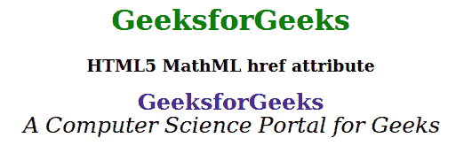

# HTML5 MathML href 属性

> 原文:[https://www.geeksforgeeks.org/html5-mathml-href-attribute/](https://www.geeksforgeeks.org/html5-mathml-href-attribute/)

href 属性用于指定链接文档的 URL。该属性被所有 [MathML 标签接受。](https://www.geeksforgeeks.org/html5-mathml-introduction/)

**语法:**

```html
<element href="valid URL">
```

**属性值:**

*   **href:** 此属性用于指定链接文档的 URL。

下面的例子说明了 HTML5 MathML 中的 href 属性:

**示例:**

```html
<!DOCTYPE html>
<html>

<head>
    <title>
        HTML5 MathML href attribute
    </title>

    <style>
        mi {
            font-size: 25px;
        }
    </style>
</head>

<body>
    <center>
        <h1 style="color:green">
            GeeksforGeeks
        </h1>

        <h3>HTML5 MathML href attribute</h3>

        <math>
            <math>
                <mi mathvariant="bold" href=
                    "https://www.geeksforgeeks.org/">
                    GeeksforGeeks
                </mi>

                <br>
            </math>
            <math>
                <mi mathvariant="italic">
                    A Computer Science
                    Portal for Geeks
                </mi>
            </math>
        </math>
    </center>
</body>

</html>
```

**输出:**



**支持的浏览器:**html 5 MathML href 属性支持的浏览器如下:

*   火狐浏览器