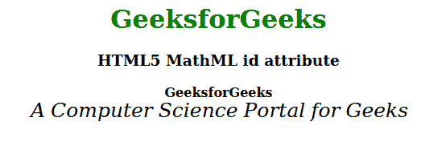

# HTML5 MathML id 属性

> 原文:[https://www.geeksforgeeks.org/html5-mathml-id-attribute/](https://www.geeksforgeeks.org/html5-mathml-id-attribute/)

id 属性是用于指定文档的唯一标识符。它被 CSS 和 JavaScript 用来为一个独特的元素执行特定的任务。该属性被所有 [MathML 标签接受。](https://www.geeksforgeeks.org/html5-mathml-introduction/)

**语法:**

```html
<element id="">
```

**属性值:**

*   **id:** 这个属性包含了 CSS 和 JavaScript 用来为一个唯一的元素执行某个任务的键。

下面的例子说明了 HTML5 MathML 中的 id 属性:

**示例:**

```html
<!DOCTYPE html> 
<html> 

<head> 
    <title>HTML5 MathML id attribute</title> 
    <style> 
        #gfg { 
            font-size:25px; 
        } 
    </style> 
</head> 

<body> 
    <center> 
        <h1 style="color:green"> 
            GeeksforGeeks 
        </h1> 

        <h3>HTML5 MathML id attribute</h3> 

        <math> 
            <math> 
                <mi mathvariant="bold"> 
                    GeeksforGeeks 
                </mi> 

                <br> 
            </math> 
            <math> 
                <mi mathvariant="italic" id="gfg"> 
                    A Computer Science 
                    Portal for Geeks 
                </mi> 
            </math> 
        </math> 
    </center> 
</body> 

</html>         
```

**输出:**



**支持的浏览器:**html 5 MathML id 属性支持的浏览器如下:

*   火狐浏览器