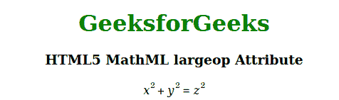

# HTML5 MathML 大运算属性

> 原文:[https://www . geesforgeks . org/html 5-mathml-large op-attribute/](https://www.geeksforgeeks.org/html5-mathml-largeop-attribute/)

此属性用于定义在设置 displaystyle="true "时，运算符是否应绘制得比正常情况大。可能值为真或假。该属性仅被 [< mo >标签](https://www.geeksforgeeks.org/html5-mathml-mo-tag/)接受。

**语法:**

```html
<element largeop="true|false">
```

**属性值:**

*   **真:**这意味着当 displaystyle="true "设置时，运算符应绘制得比正常情况大。
*   **false:** 这意味着当设置 displaystyle="true "时，运算符不应绘制得比正常情况大。

下面的例子说明了 HTML5 MathML 中的 largeop 属性:

**示例:**

## 超文本标记语言

```html
<!DOCTYPE html>
<html>

<head>
    <title>HTML5 MathML largeop Attribute</title>
</head>

<body style="text-align:center;">

    <h1 style="color:green">
        GeeksforGeeks
    </h1>

    <h3>HTML5 MathML largeop Attribute</h3>

    <math displaystyle="true">
        <mrow>
            <mrow>
                <msup>
                    <mi>x</mi>
                    <mn>2</mn>
                </msup>
                <mo largeop="false">+</mo>
                <msup>
                    <mi>y</mi>
                    <mn>2</mn>
                </msup>
            </mrow>
            <mo largeop="true">=</mo>
            <msup>
                <mi>z</mi>
                <mn>2</mn>
            </msup>
        </mrow>
    </math>
</body>

</html>
```

**输出:**



**支持的浏览器:**html 5 MathML large op 属性支持的浏览器如下:

*   火狐浏览器