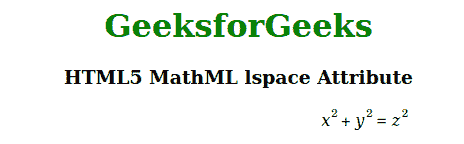

# HTML5 MathML lspace 属性

> 原文:[https://www . geesforgeks . org/html 5-mathml-lspace-attribute/](https://www.geeksforgeeks.org/html5-mathml-lspace-attribute/)

此属性保存运算符默认值 thickmathspace (4.32px)之前的空间长度值。这个属性被两个 MathML 标签 [< mo >](https://www.geeksforgeeks.org/html5-mathml-mo-tag/) 和[T6 所接受>](https://www.geeksforgeeks.org/html5-mathml-mpadded-tag/) 相加。

**语法:**

```html
<element lspace="intheight">

```

**属性值:**

*   **lspace:** 该属性是运算符默认值 thickmathspace (4.32px)之前的空间长度值。

**示例:**下面的示例说明了 HTML5 MathML 中的 *lspace* 属性。

## 超文本标记语言

```html
<!DOCTYPE html>
<html>

<body style="text-align:center;">

    <h1 style="color:green">
        GeeksforGeeks
    </h1>
    <h3>HTML5 MathML lspace Attribute</h3>

    <math>
        <mpadded lspace="7height">
            <mrow>
                <mrow>
                    <msup>
                        <mi>x</mi>
                        <mn>2</mn>
                    </msup>
                    <mo>+</mo>
                    <msup>
                        <mi>y</mi>
                        <mn>2</mn>
                    </msup>
                </mrow>
                <mo>=</mo>
                <msup>
                    <mi>z</mi>
                    <mn>2</mn>
                </msup>
            </mrow>
        </mpadded>
    </math>
</body>

</html>
```

**输出:**

，

**支持的浏览器:**html 5 MathML*ls space*属性支持的浏览器如下。

*   火狐浏览器