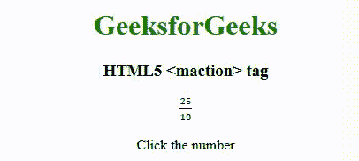

# HTML5 | MathML <maction>标签</maction>T3】

> 原文:[https://www.geeksforgeeks.org/html5-mathml-maction-tag/](https://www.geeksforgeeks.org/html5-mathml-maction-tag/)

**HTML5 MathML <标记>标记**是 HTML5 的一个内置元素，用于显示任何表达式的绑定动作。您可以对该元素使用任何选择属性。
**语法:**

```html
<maction> child elements </maction> 
```

**属性:**<标记接受下面提到的属性:

*   **动作类型:**该属性包含三种动作类型*状态*、*切换*和*工具提示*它们的行为各不相同。
*   **class| id| style:** 该属性用于保存子元素的样式。
*   **href:** 该属性用于保存任何指向指定网址的超链接。
*   **数学背景:**该属性保存数学表达式背景颜色的值。
*   **mathcolor:** 该属性保存数学表达式的颜色。
*   **选择:**该属性默认值为 1 表示第 1 个子元素。它保存子元素的选择

下面的例子将说明**html 5 MathML<maction>**tag
**的概念示例:**

## 超文本标记语言

```html
<!DOCTYPE html>
<html>
    <head>
        <title>HTML5 maction tag</title>
    </head>
    <body>
        <center>
            <h1 style="color:green">GeeksforGeeks</h1>
            <h3>HTML5 <maction> tag</h3>
            <math>
                <maction actiontype="toggle">
                    <mfrac>
                        <mn>25</mn>
                        <mn>10</mn>
                    </mfrac>
                    <mfrac>
                        <mrow>
                            <mn>5</mn>
                            <mo>⋅</mo>
                            <mn>5</mn>
                        </mrow>
                        <mrow>
                            <mn>2</mn>
                            <mo>⋅</mo>
                            <mn>5</mn>
                        </mrow>
                    </mfrac>
                    <mfrac>
                        <mn>5</mn>
                        <mn>2</mn>
                    </mfrac>
                </maction>
            </math>

<p>Click the number</p>

        </center>
    </body>
</html>
```

**输出:**



**支持的浏览器:**支持的浏览器有**html 5 MathML<maction>**标签如下:

*   火狐浏览器
*   旅行队

**注意:**(到目前为止还没有其他浏览器支持 MathML 元素)