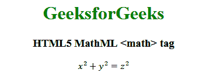

# HTML5 | MathML <math>标签</math>T3】

> 原文:[https://www.geeksforgeeks.org/html5-mathml-math-tag/](https://www.geeksforgeeks.org/html5-mathml-math-tag/)

HTML5 中的 **MathML <数学>标签**是最优先的元素。无论你想使用什么 MathML 元素，它们都应该被包装在<数学>标签里面。
**语法:**

```html
<math> child elements </math>
```

**属性:**标签接受下面列出的一些属性:

*   **class|id|style:** 该属性用于保存子元素的样式。
*   **方向:**该属性保存方向值。它保存两种类型的方向值，从左到右为 ltr，从右到左为 rtl。
*   **href:** 此属性用于保存任何指向指定 URL 的超链接。
*   **数学背景:**该属性保存数学表达式背景颜色的值。
*   **mathcolor:** 该属性保存数学表达式的颜色。
*   **显示:**该属性保存 HTML 元素的渲染值。可以有两个值**块**表示该元素将显示在当前文本范围之外，**内联**表示该元素将显示在当前文本范围之内。
*   **模式:**表示显示属性，可能的值有*显示*和**直列**。
*   **溢出:**它保存表达式将如何表现的值。默认值为**换行符**，其他可能的值为**滚动、省略、截断、**和**缩放**。

以下示例说明了 HTML5 中的 MathML <math>标记:</math>
**示例:**

## 超文本标记语言

```html
<!DOCTYPE html>
<html>

<head>
    <title>HTML5 MathML math tag</title>
</head>

<body>
    <center>
        <h1 style="color:green">
            GeeksforGeeks
        </h1>

        <h3>HTML5 MathML <math> tag</h3>

        <math>
            <mrow>
                <mrow>
                    <msup>
                        <mi>x</mi>
                        <mn>2</mn>
                    </msup>
                    <mo>+</mo>
                    <msup>
                        <mi>y</mi>
                        <mn>2</mn>
                    </msup>
                </mrow>
                <mo>=</mo>
                <msup>
                    <mi>z</mi>
                    <mn>2</mn>
                </msup>
            </mrow>
        </math>
    </center>
</body>

</html>
```

**输出:**



**支持的浏览器:**html 5 MathML<math>标签支持的浏览器如下:

*   火狐浏览器
*   旅行队