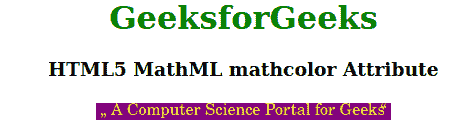

# HTML5 MathML mathcolor 属性

> 原文:[https://www . geesforgeks . org/html 5-mathml-math color-attribute/](https://www.geeksforgeeks.org/html5-mathml-mathcolor-attribute/)

HTML5 中的 **MathML mathcolor** 属性用于指定数学表达式中使用的前景色。颜色可以以任何形式定义，可以是 RGB 或任何字符串颜色名称。所有的 MathML 标签都接受这个属性。

**语法:**

```html
<element mathcolor="colorname">
```

**属性值:**该属性具有如上所述的单一值，如下所述:

*   **colorname:** 它是定义用于 MathML 标记的颜色的值。

下面的例子说明了 **MathML mathcolor** 属性:

**示例:**

## 超文本标记语言

```html
<!DOCTYPE html>
<html>

<body style="text-align:center;">
    <h1 style="color:green">
        GeeksforGeeks
    </h1>

    <h3>HTML5 MathML mathcolor Attribute</h3>

    <math>
        <ms lquote="„" rquote=" “" 
            mathcolor="Yellow" mathbackground="Purple">
            A Computer Science Portal for Geeks
        </ms>
    </math>
</body>

</html>
```

**输出:**



**支持的浏览器:****html 5 MathML math color**属性支持的浏览器如下:

*   火狐浏览器