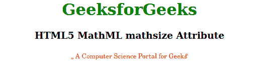
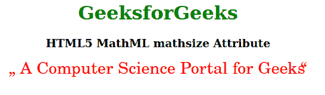

# HTML5 MathML mathsize 属性

> 原文:[https://www . geesforgeks . org/html 5-mathml-mathsize-attribute/](https://www.geeksforgeeks.org/html5-mathml-mathsize-attribute/)

HTML5 中的 **MathML mathsize** 属性用于指定内容的大小。可能的值有小的、正常的、大的或自定义长度值。该属性被 [< mi >](https://www.geeksforgeeks.org/html5-mathml-mi-tag/) 、 [< mn >](https://www.geeksforgeeks.org/html5-mathml-mn-tag/) 、 [< mo >](https://www.geeksforgeeks.org/html5-mathml-mo-tag/) 、 [< ms >](https://www.geeksforgeeks.org/html5-mathml-ms-tag/) 和 [<多行文字>](https://www.geeksforgeeks.org/html5-mathml-mtext-tag/) 标签接受。

**语法:**

```html
<element mathsize="small | normal | big | length">

```

**属性值:**该属性有四个值，如上所述，描述如下:

*   **小:**该值将内容设置为比正常大小更小的大小。
*   **正常:**该值将内容大小设置为正常。这是内容的原始大小。
*   **大:**该值将内容设置为比正常大小更大的大小。
*   **长度:**该值可用于将内容大小设置为任意给定值。

以下示例说明了 **MathML mathsize** 属性:

**例 1:**

## 超文本标记语言

```html
<!DOCTYPE html>
<html>

<body style="text-align:center;">

    <h1 style="color:green">
        GeeksforGeeks
    </h1>

    <h3>HTML5 MathML mathsize Attribute</h3>

    <math>
        <ms lquote="„" rquote=" “" 
            mathcolor="Red" mathsize="small">
            A Computer Science Portal for Geeks
        </ms>
    </math>
</body>

</html>
```

**输出:**



**例 2:**

## 超文本标记语言

```html
<!DOCTYPE html>
<html>

<body style="text-align:center;">
    <h1 style="color:green">
        GeeksforGeeks
    </h1>

    <h3>HTML5 MathML mathsize Attribute</h3>

    <math>
        <ms lquote="„" rquote=" “" 
            mathcolor="Red" mathsize="28px">
            A Computer Science Portal for Geeks
        </ms>
    </math>
</body>

</html>
```

**输出:**



**支持的浏览器:****html 5 MathML mathsize**属性支持的浏览器如下:

*   火狐浏览器