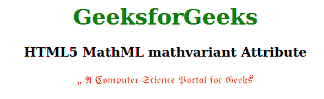

# HTML5 MathML mathvariant 属性

> 原文:[https://www . geesforgeks . org/html 5-mathml-math variant-attribute/](https://www.geeksforgeeks.org/html5-mathml-mathvariant-attribute/)

HTML5 中的 **MathML mathvariant** 属性用于指定用于显示文本的逻辑类。这可以用来改变显示文本的排版。该属性支持的所有可能的值是普通、粗体、斜体、粗体-斜体、双击、粗体-框架、脚本、粗体-脚本、框架、无衬线、粗体-无衬线、无衬线-斜体、无衬线-粗体-斜体、等间距、初始、尾部、环形和拉伸。该属性被[<mi>](https://www.geeksforgeeks.org/html5-mathml-mi-tag/)[<Mn>](https://www.geeksforgeeks.org/html5-mathml-mn-tag/)[<mo>](https://www.geeksforgeeks.org/html5-mathml-mo-tag/)[<ms>](https://www.geeksforgeeks.org/html5-mathml-ms-tag/)和 [<多行文字>](https://www.geeksforgeeks.org/html5-mathml-mtext-tag/) 标签接受。

**语法:**

```html
<element mathvariant="logical class">

```

**属性值:**该属性具有如上所述的单一值，如下所述:

*   **逻辑类:**该值将元素的逻辑类设置为可用值之一。

以下示例说明了 **MathML mathvariant** 属性:

**例 1:**

## 超文本标记语言

```html
<!DOCTYPE html>
<html>

<body style="text-align:center;">
    <h1 style="color:green">
        GeeksforGeeks
    </h1>

    <h3>HTML5 MathML mathvariant Attribute</h3>

    <math>
        <ms lquote="„" rquote=" “" 
            mathcolor="Red" 
            mathvariant="sans-serif">
            A Computer Science Portal for Geeks
        </ms>
    </math>
</body>

</html>
```

**输出:**


**例 2:**

## 超文本标记语言

```html
<!DOCTYPE html>
<html>

<body style="text-align:center;">

    <h1 style="color:green">
        GeeksforGeeks
    </h1>

    <h3>HTML5 MathML mathvariant Attribute</h3>

    <math>
        <ms lquote="„" rquote=" “" 
            mathcolor="Red" mathvariant="fraktur">
            A Computer Science Portal for Geeks
        </ms>
    </math>
</body>

</html>
```

**输出:**



**支持的浏览器:**html 5**MathML math variant**属性支持的浏览器如下:

*   火狐浏览器