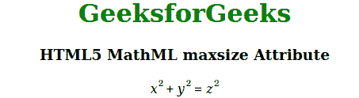

# HTML5 MathML maxsize 属性

> 原文:[https://www . geesforgeks . org/html 5-mathml-maxsize-attribute/](https://www.geeksforgeeks.org/html5-mathml-maxsize-attribute/)

如果伸缩设置为真，则此属性保存运算符的最大大小。可能的值是无穷大或任何长度单位。该属性仅被 [< mo >](https://www.geeksforgeeks.org/html5-mathml-mo-tag/) 标签接受。

**语法:**

```html
<element maxsize="numbers">

```

**属性值:**

*   **数字:**该属性设置运算符的大小。

下面的例子说明了 HTML5 MathML 中的最大大小:

**示例:**

## 超文本标记语言

```html
<!DOCTYPE html> 
<html> 

<head> 
    <title>HTML5 MathML maxsize Attribute</title> 
</head> 

<body style="text-align:center;"> 

    <h1 style="color:green"> 
        GeeksforGeeks 
    </h1> 

    <h3>HTML5 MathML maxsize Attribute</h3> 

    <math> 
        <mrow> 
            <mrow> 
                <msup> 
                    <mi>x</mi> 
                    <mn>2</mn> 
                </msup> 
                <mo stretchy="true" 
                    maxsize="250em">+</mo> 
                <msup> 
                    <mi>y</mi> 
                    <mn>2</mn> 
                </msup> 
            </mrow> 
            <mo stretchy="true" 
                 maxsize="30em">=</mo> 
            <msup> 
                <mi>z</mi> 
                <mn>2</mn> 
            </msup> 
        </mrow> 
    </math> 
</body> 

</html>
```

**输出:**



**支持的浏览器:**html 5 MathML maxsize 属性支持的浏览器如下:

*   火狐浏览器