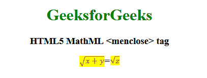

# HTML5 | MathML <menclose>标签</menclose>T3】

> 原文:[https://www.geeksforgeeks.org/html5-mathml-menclose-tag/](https://www.geeksforgeeks.org/html5-mathml-menclose-tag/)

**HTML5 MathML < menclose >标签**标签是 HTML5 中的一个内置元素。它用于呈现符号属性指定的封闭符号内部的内容。
**语法:**

```html
<menclose attribute="value "> child elements </menclose">
```

**属性:**标签接受下面列出的一些属性:

*   **class| id| style:** 该属性用于保存子元素的样式。
*   **href:** 该属性用于保存任何指向指定网址的超链接。
*   **数学背景:**该属性保存数学表达式背景颜色的值。
*   **mathcolor:** 该属性保存数学表达式的颜色。
*   **符号:**该属性保存符号，每个符号都像其他符号不存在一样绘制，一次使用多个符号会出现符号重叠。可能的值有**精算**、**底部**、**框**、**圆**、**下对角三叉**、**左**、**龙第四**、**马达鲁布**、 **phasorangle** 、**部首**、**右**、**圆头【T25**

以下示例将说明**html 5 MathML<menclose>**的概念标签:
**示例:**

## 超文本标记语言

```html
<!DOCTYPE html>
<html>

<head>
    <title>HTML5 MathML menclose tag</title>
</head>

<body style="text-align:center;">

    <h1 style="color:green">GeeksforGeeks</h1>

    <h3>HTML5 MathML <menclose> tag</h3>

    <math>
        <math>
            <menclose notation="radical "
                    mathbackground="yellow"
                    mathcolor="purple">
                <mrow>
                    <mi> x </mi>
                    <mo> + </mo>
                    <mi> y </mi>
                </mrow>
            </menclose>
            <mi>=</mi>
            <menclose notation="radical"
                    mathbackground="yellow"
                    mathcolor="purple">
                <mi>z</mi>
            </menclose>
        </math>
    </math>
</body>

</html>               
```

**输出:**



**支持的浏览器:**支持的浏览器有**html 5 MathML<menclose>**标签如下:

*   火狐浏览器
*   旅行队