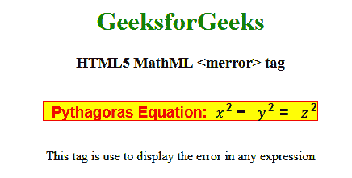

# HTML5 | MathML <merror>标签</merror>T3】

> 原文:[https://www.geeksforgeeks.org/html5-mathml-merror-tag/](https://www.geeksforgeeks.org/html5-mathml-merror-tag/)

**HTML5 MathML < merror >标记**标记是 HTML5 中的一个内置元素，用于将表达式包装在一个框中，使该表达式引人注目。该标签用于显示错误信息。通常，当您的 MathML 标记出错或发生任何类型的错误时，它不会单独弹出，您会得到一个 XML 解析。
**语法:**

```html
<merror> child elements </merror>
```

**属性:**该标签接受以下列出的一些属性:

*   **class|id|style:** 该属性用于保存子元素的样式。
*   **href:** 该属性用于保存任何指向指定网址的超链接。
*   **数学背景:**该属性保存数学表达式背景颜色的值。
*   **mathcolor:** 该属性保存数学表达式的颜色。

以下示例将说明 **HTML5 < merror >** 的概念标签:
**示例:**

## 超文本标记语言

```html
<!DOCTYPE html>
<html>

<head>
    <title>HTML5 MathML merror tag</title>
</head>

<body style="text-align:center;">

    <h1 style="color:green">GeeksforGeeks</h1>

    <h3>HTML5 MathML <merror> tag</h3>

    <math>
        <merror mathbackground="yellow">
            <mtext mathcolor="red">
                Pythagoras Equation:
            </mtext>
            <mrow>
                <msup>
                    <mi> x </mi>
                    <mn>2 </mn>
                </msup>
                <mo>-</mo>
                <msup>
                    <mi> y </mi>
                    <mn>2 </mn>
                </msup>
            </mrow>
            <mo>=</mo>
            <msup>
                <mi> z </mi>
                <mn>2 </mn>
            </msup>
        </merror>
    </math>

<p>
        This tag is use to display the
        error in any expression
    </p>

</body>

</html>        
```

**输出:**



**支持的浏览器:**支持的浏览器有 **HTML5 MathML < merror >标签**如下:

*   火狐浏览器
*   狩猎