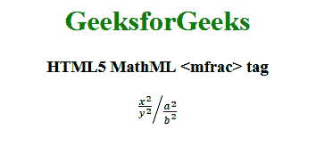

# HTML5 | MathML <mfrac>标签</mfrac>T3】

> 哎哎哎::1230【https://www . geeksforgeeks . org/html 5-mathml-mfrac 标签/

**HTML5 MathML < mfrac >标签**是 HTML5 中的一个内置元素。它用于在两位数或等式之间添加分数符号。
**语法:**

```html
<mfrac> numerator denominator </mfrac> 
```

**属性:**该标签接受下述属性:

*   **斜切:**该属性保存分数的显示方式。如果值为真，分子和分母并排显示，并用斜线隔开。如果该值为假(默认值)，则显示的分子和分母相互重叠。
*   **class| id| style:** 该属性用于保存子元素的样式。
*   **href:** 该属性用于保存任何指向指定网址的超链接。
*   **数学背景:**该属性保存数学表达式背景颜色的值。
*   **mathcolor:** 该属性保存数学表达式的颜色。
*   **分母:**该属性保存分母的对齐值，可能的值为左、中、**右**。
*   **线宽:**该属性保存分数的厚度值。可能的值是**粗**、**中**和**细**。
*   **numerical:**该属性保存分子的对齐值，可能的值为左、右、中。

以下示例说明了 HTML5 中的 MathML <mfrac>标记:
**示例:**</mfrac> 

## 超文本标记语言

```html
<!DOCTYPE html>
<html>

<head>
    <title>HTML5 MathML mfrac tag</title>
</head>

<body>
    <center>
        <h1 style="color:green">
            GeeksforGeeks
        </h1>

        <h3>HTML5 MathML <mfrac> tag</h3>

        <math>
            <mfrac bevelled="true">
                <mfrac>
                    <msup>
                        <mi>x</mi>
                        <mn>2</mn>
                    </msup>
                    <msup>
                        <mi>y</mi>
                        <mn>2</mn>
                    </msup>
                </mfrac>
                <mfrac>
                    <msup>
                        <mi>a</mi>
                        <mn>2</mn>
                    </msup>
                    <msup>
                        <mi>b</mi>
                        <mn>2</mn>
                    </msup>
                </mfrac>
            </mfrac>
        </math>
    </center>
</body>

</html>
```

**输出:**



**支持的浏览器:**html 5 MathML<mfrac>标签支持的浏览器如下:

*   火狐浏览器
*   旅行队