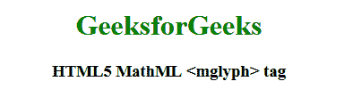

# HTML5 | MathML <mglyph>标签</mglyph>T3】

> 原文:[https://www.geeksforgeeks.org/html5-mathml-mglyph-tag/](https://www.geeksforgeeks.org/html5-mathml-mglyph-tag/)

HTML5 中的 **MathML < mglyph >** 标签用于打印非标准符号。它仅用于 Unicode 字符上不可用的字符或符号。

**语法:**

```html
<mglyph src="pathe" alt="" width="value" height="value"/>
```

**属性:**该标签接受下面列出的一些属性:

*   **alt:** 如果图像不受支持或路径不正确，此属性定义描述图像的替代文本。
*   **class|id|style:** 该属性用于保存子元素的样式。
*   **href:** 该属性用于保存任何指向指定网址的超链接。
*   **数学背景:**该属性保存数学表达式背景颜色的值。
*   **高度:**该属性定义图像的高度。
*   **宽度:**该属性定义图像的宽度。
*   **src:** 该属性保存图像 URL。
*   **valign:** 该属性保持当前基线上的垂直对齐基准。

下面的例子说明了 HTML5 中的 MathML <mglyph>标记:</mglyph>

**示例:**

```html
<!DOCTYPE html>
<html>

<head>
    <title>HTML5 MathML mglyph tag</title>
</head>

<body>
    <center>
        <h1 style="color:green">
            GeeksforGeeks
        </h1>

        <h3>HTML5 MathML <mglyph> tag</h3>

        <math>
            <mi>
                <mglyph src="glyph.png" alt="glyph"
                        width="20px" height="10px" />
            </mi>
        </math>
    </center>
</body>

</html>
```

**输出:**


**支持的浏览器:**任何浏览器都不支持该标签。