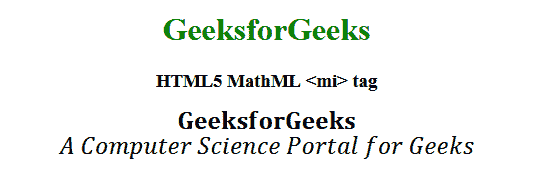

# HTML5 | MathML <mi>标签</mi>T3】

> 吴奇珍:t0]https://www . geeksforgeeks . org/html 5-mathml-mi 标记/

HTML5 中的 **MathML < mi >标签**被用作标识符，例如任何种类的符号或功能。您可以在这个标签中放入任何语句。
**语法:**

```html
<mi> element </mi>
```

**属性:**该标签接受以下列出的一些属性:

*   **class|id|style:** 该属性用于保存子元素的样式。
*   **href:** 此属性用于保存任何指向指定 URL 的超链接。
*   **数学背景:**该属性保存数学表达式背景颜色的值。
*   **mathcolor:** 该属性保存数学表达式的颜色。
*   **方向:**该属性保存方向值。两种类型的方向值是可接受的从左到右的 ltr 和从右到左的 rtl。
*   **mathsize:** 该属性保存内容的大小值。可能的数值有**小**、**中**和**大**。
*   **mathvariant:** 该属性包含各种字体，如字体系列。

以下示例说明了 HTML5 中的 MathML <mi>标记:
**示例:**</mi> 

## 超文本标记语言

```html
<!DOCTYPE html>
<html>

<head>
    <title>HTML5 MathML mi tag</title>
    <style>
        mi {
            font-size:25px;
        }
    </style>
</head>

<body>
    <center>
        <h1 style="color:green">
            GeeksforGeeks
        </h1>

        <h3>HTML5 MathML <mi> tag</h3>

        <math>
            <math>
                <mi mathvariant="bold">
                    GeeksforGeeks
                </mi>

                <br>
            </math>
            <math>
                <mi mathvariant="italic">
                    A Computer Science
                    Portal for Geeks
                </mi>
            </math>
        </math>
    </center>
</body>

</html>        
```

**输出:**



**支持的浏览器:**以下列出了 **HTML5 MathML < mi >标签**支持的浏览器:

*   火狐浏览器
*   旅行队