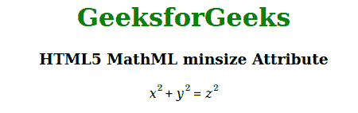

# HTML5 MathML minsize 属性

> 原文:[https://www . geesforgeks . org/html 5-mathml-minsize-attribute/](https://www.geeksforgeeks.org/html5-mathml-minsize-attribute/)

如果拉伸设置为*真*，则该属性保持操作者的最小尺寸。可能的值是无穷大或任何长度单位。该属性仅被< mo >标签接受。

**语法:**

```html
<element maxsize="numbers">

```

**属性值:**

*   **数字:**该属性设置运算符的大小。

**示例:**下面的示例说明了 HTML5 MathML 中的 *minsize* 属性。

## 超文本标记语言

```html
<!DOCTYPE html> 
<html> 

<body style="text-align:center;"> 

    <h1 style="color:green"> 
        GeeksforGeeks 
    </h1> 

    <h3>HTML5 MathML minsize Attribute</h3> 

    <math> 
        <mrow> 
            <mrow> 
                <msup> 
                    <mi>x</mi> 
                    <mn>2</mn> 
                </msup> 
                <mo stretchy="true" 
                    minsize="250em">+</mo> 
                <msup> 
                    <mi>y</mi> 
                    <mn>2</mn> 
                </msup> 
            </mrow> 
            <mo stretchy="true" 
                minsize="30em">=</mo> 
            <msup> 
                <mi>z</mi> 
                <mn>2</mn> 
            </msup> 
        </mrow> 
    </math> 
</body> 

</html> 
```

**输出:**



**支持的浏览器:**html 5 MathML*minsize*属性支持的浏览器如下:

*   火狐浏览器