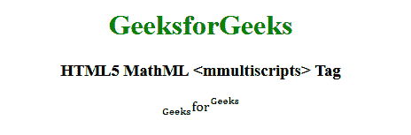

# HTML5 | MathML <mmultiscripts>标签</mmultiscripts>T3】

> 原文:[https://www . geesforgeks . org/html 5-mathml-mmultiscripts-tag/](https://www.geeksforgeeks.org/html5-mathml-mmultiscripts-tag/)

HTML5 中的 **MathML <免疫脚本>标签**用于创建多维矩阵。程度取决于代表性阵列的条件。因为数字是 0 维数组。一阶张量和二阶张量作为一个矩阵将代表一个一维数组。
**语法:**

```html
 <mmultiscripts> child elements </mmultiscripts>
```

**属性:**该标签接受下述属性:

*   **class|id|style:** 该属性保存子元素的样式。
*   **href:** 该属性保存到指定网址的任何超链接。
*   **数学背景:**该属性保存数学表达式背景颜色的值。
*   **mathcolor:** 该属性保存数学表达式的颜色。
*   **下标移位:**该属性定义了将下标移位到表达式基线以下的最小空间。
*   **上标移位:**该属性定义了将下标移位到表达式基线之上的最小空间

下面的例子说明了 HTML5 MathML 的概念<mmultiscripts>标签:
**例子:**</mmultiscripts> 

## 超文本标记语言

```html
<!DOCTYPE html>
<html>

<head>
    <title>HTML5 MathML mmultiscripts tag</title>
</head>

<body>
    <center>
        <h1 style="color:green">GeeksforGeeks</h1>

        <h3>HTML5 MathML <mmultiscripts> Tag</h3>

        <math>
            <mmultiscripts>

                <!-- base expression -->
                <mi>for</mi>

                <!-- postsubscript -->
                <none />

                <!-- postsuperscript -->
                <mi>Geeks</mi>

                <mprescripts />

                <!-- presubscript -->
                <mi>Geeks</mi>

                <!-- presuperscript -->
                <none />

            </mmultiscripts>
        </math>
    </center>
</body>

</html>
```

**输出:**



**支持的浏览器:**html 5 MathML<mmultimates>标签支持的浏览器如下:

*   火狐浏览器
*   旅行队