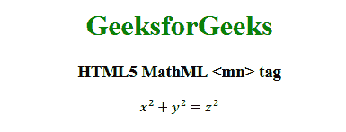

# HTML5 | MathML <mn>标签</mn>T3】

> 原文:[https://www.geeksforgeeks.org/html5-mathml-mn-tag/](https://www.geeksforgeeks.org/html5-mathml-mn-tag/)

HTML5 中的 **MathML < mn >** 标签用于显示一个数字字符，该字符通常是一个带有可能分隔符的数字序列。它包含任意字符，使用类似 4 的字符作为 4。
**语法:**

```html
<mn> Numeric </mn>
```

**属性:**接受以下列出的部分属性:

*   **class|id|style:** 该属性用于保存子元素的样式。
*   **方向:**该属性保存方向值。方向值对于从左到右是可接受的 ltr，对于从右到左是可接受的 rtl。
*   **href:** 此属性用于保存任何指向指定 URL 的超链接。
*   **数学背景:**该属性保存数学表达式背景颜色的值。
*   **mathcolor:** 该属性保存数学表达式的颜色。
*   **mathsize:** 该属性保存内容的大小值。可能的值有小、中、大。
*   **mathvariant:** 该属性包含各种字体，如字体系列。

以下示例说明了 HTML 5 中的 MathML <mn>标记:
**示例:**</mn> 

## 超文本标记语言

```html
<!DOCTYPE html>
<html>

<head>
    <title>HTML5 MathML mn tag</title>
</head>

<body style="text-align:center;">

    <h1 style="color:green">
        GeeksforGeeks
    </h1>

    <h3>HTML5 MathML <mn> tag</h3>

    <math>
        <mrow>
            <mrow>
                <msup>
                    <mi>x</mi>
                    <mn>2</mn>
                </msup>
                <mo>+</mo>
                <msup>
                    <mi>y</mi>
                    <mn>2</mn>
                </msup>
            </mrow>
            <mo>=</mo>
            <msup>
                <mi>z</mi>
                <mn>2</mn>
            </msup>
        </mrow>
    </math>
</body>

</html>
```

**输出:**



**支持的浏览器:**以下列出了 **HTML5 MathML < mn >** 标签支持的浏览器:

*   火狐浏览器
*   旅行队

**注意:**到目前为止还没有其他浏览器支持 MathML 元素。