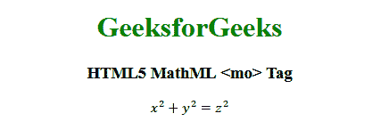

# HTML5 | MathML <mo>标签</mo>T3】

> 原文:[https://www.geeksforgeeks.org/html5-mathml-mo-tag/](https://www.geeksforgeeks.org/html5-mathml-mo-tag/)

HTML5 中的 **MathML < mo >** 标签用于元素之间的打印操作符。这个标签可以使用任何类型的数学运算符。
**语法:**

```html
<mo> operator </mo>
```

**属性:**该标签接受以下列出的一些属性:

*   **重音:**该属性用于指定运算符是否应被视为重音。可能的值为真或假。
*   **class|id|style:** 该属性用于保存子元素的样式。
*   **href:** 此属性用于保存任何指向指定 URL 的超链接。
*   **围栏:**该属性指定操作员是否为围栏。可能的值为真或假。
*   **形式:**该属性用于在+等普通运算符的情况下指定运算符的角色，–不是必需的。可能的值有前缀、中缀和后缀。
*   **largeop:** 此运算符用于定义当 displaystyle="true "设置时，运算符是否应绘制得比正常情况大。可能值为真或假。
*   **lspace:** 该属性保存运算符默认值 thickmathspace (4.32px)之前的空间长度值。
*   **rspace:** 该属性保存运算符默认值 thickmathspace (4.32px)后的空间长度值。
*   **数学背景:**该属性保存数学表达式背景颜色的值。
*   **mathcolor:** 该属性保存数学表达式的颜色。
*   **dir:** 这个属性保存方向两种类型的方向值是可接受的 ltr(从左到右)和 rtl(从右到左)。
*   **mathsize:** 该属性保存内容的大小值。可能的值有小、中、大。
*   **mathvariant:** 该属性包含各种字体，如字体系列。
*   **分隔符:**该属性保存每个字符串或任何想要从任何内容中分离的内容的分隔符。
*   **拉伸:**该属性定义操作符是否拉伸到相邻元素的大小。可能的值为真或假。
*   **最大大小:**如果伸缩设置为真，则该属性保存运算符的最大大小。可能的值是无穷大或任何长度单位。
*   **最小化:**如果伸缩设置为真，则该属性保存操作符的最小大小。可能的值是无穷大或任何长度单位。
*   **对称:**如果拉伸设置为真，则该属性指定运算符是否应围绕假想数学轴垂直对称。

下面的例子说明了 HTML5 MathML 的概念<mo>标签:
**例子:**</mo> 

## 超文本标记语言

```html
<!DOCTYPE html>
<html>

<head>
    <title>HTML5 MathML mo tag</title>
</head>

<body style="text-align:center;">

    <h1 style="color:green">
        GeeksforGeeks
    </h1>

    <h3>HTML5 MathML <mo> Tag</h3>

    <math>
        <mrow>
            <mrow>
                <msup>
                    <mi>x</mi>
                    <mn>2</mn>
                </msup>
                <mo>+</mo>
                <msup>
                    <mi>y</mi>
                    <mn>2</mn>
                </msup>
            </mrow>
            <mo>=</mo>
            <msup>
                <mi>z</mi>
                <mn>2</mn>
            </msup>
        </mrow>
    </math>
</body>

</html>
```

**输出:**



**支持的浏览器:**支持的浏览器有 **HTML5 MathML < mo >** 标签如下:

*   火狐浏览器
*   旅行队