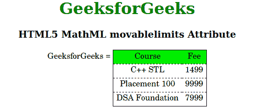

# HTML5 MathML 可移动限制属性

> 原文:[https://www . geeksforgeeks . org/html 5-mathml-movable limits-at ribute/](https://www.geeksforgeeks.org/html5-mathml-movablelimits-atrribute/)

此属性用于定义当 displaystyle 为 false 时，附加的下和上脚本是否移动到子和上标位置。该属性被 [< mo >](https://www.geeksforgeeks.org/html5-mathml-mo-tag/) 标签接受。

**语法:**

```html
<element movablelimits="true|false">
```

**属性值:**

*   **真:**使操作者可移动。
*   **假:**使操作者停止移动。

以下示例说明了 HTML5 MathML 中的可移动限制:

**示例:**

## 超文本标记语言

```html
<!DOCTYPE html>
<html>

<head>
    <title>HTML5 MathML movablelimits Attribute</title>
</head>

<body>
    <center>
        <h1 style="color:green">
            GeeksforGeeks
        </h1>

        <h3>HTML5 MathML movablelimits Attribute</h3>

        <math>
            <mi>GeeksforGeeks</mi>
            <mo movablelimits="false">=</mo>
            <mtable displaystyle="false"
                    frame="solid" rowlines="dashed"
                    align="axis 1">
                <mtr mathbackground="green;">
                    <mtd>Course</mtd>
                    <mtd>Fee</mtd>
                </mtr>
                <mtr>
                    <mtd>
                        <mi>C++ STL</mi>
                    </mtd>
                    <mtd>
                        <mi> 1499</mi>
                    </mtd>
                </mtr>
                <mtr>
                    <mtd>
                        <mi>Placement 100 </mi>
                    </mtd>
                    <mtd>
                        <mi>9999 </mi>
                    </mtd>
                </mtr>
                <mtr>
                    <mtd>
                        <mi>DSA Foundation </mi>
                    </mtd>
                    <mtd>
                        <mi>7999</mi>
                    </mtd>
                </mtr>
            </mtable>
        </math>
    </center>
</body>

</html>
```

**输出:**



**支持的浏览器:**html 5 MathML movable limits 属性支持的浏览器如下:

*   火狐浏览器