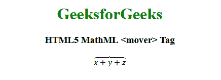

# HTML5 | MathML <mover>标签</mover>T3】

> 原文:[https://www.geeksforgeeks.org/html5-mathml-mover-tag/](https://www.geeksforgeeks.org/html5-mathml-mover-tag/)

**HTML5 MathML < mover >** 标签是 HTML5 中的内置标签。此标记用于在表达式上附加重音符号或限制。
**语法:**

```html
<mover> base overscript </mover>
```

**属性:**该标签接受下述属性:

*   **class|id |style:** 该属性保存子元素的样式。
*   **href:** 该属性保存到指定网址的任何超链接。
*   **数学背景:**该属性保存数学表达式背景颜色的值。
*   **mathcolor:** 该属性保存数学表达式的颜色。
*   **对齐:**该属性保存过脚本的对齐值。可能的值是左、右和中间
*   **重音:**该属性指定运算符是否应被视为重音。可能的值为真或假。

下面的例子说明了 HTML5 MathML <mover>标签的概念:</mover> 

## 超文本标记语言

```html
<!DOCTYPE html>
<html>

<head>
    <title>HTML5 MathML mover tag</title>
</head>

<body>
    <center>
        <h1 style="color:green">GeeksforGeeks</h1>

        <h3>HTML5 MathML <mover> Tag</h3>

        <math>
            <mover accent="true">
                <mrow>
                    <mi> x </mi>
                    <mo> + </mo>
                    <mi> y </mi>
                    <mo> + </mo>
                    <mi> z </mi>
                </mrow>
                <mo>⏞</mo>
            </mover>
        </math>
    </center>
</body>

</html>
```

**输出:**



**支持的浏览器:**html 5 MathML<Mover>标签支持的浏览器如下:

*   火狐浏览器
*   旅行队