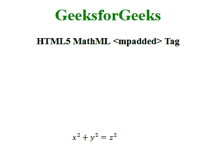

# HTML5 | MathML <mpadded>标签</mpadded>T3】

> 原文:[https://www.geeksforgeeks.org/html5-mathml-mpadded-tag/](https://www.geeksforgeeks.org/html5-mathml-mpadded-tag/)

HTML5 中的 **MathML <添加的>** 标签用于添加额外的填充，并设置所包含内容的位置和大小的一般调整。

**语法:**

```html
<mpadded attribute="value"> </mpadded> 
```

**属性:**

*   **class|id|style:** 该属性用于保存子元素的样式。
*   **数学背景:**该属性保存数学表达式背景颜色的值。
*   **mathcolor:** 该属性保存数学表达式的颜色。
*   **href:** 该属性用于保存任何指向指定网址的超链接。
*   **高度**该属性用于设置内容的高度或增加/减少内容的高度。
*   **宽度:**该属性用于设置内容的宽度或增加/减少内容的宽度。
*   **深度:**此属性用于设置深度或增加/减少内容的深度。
*   **lspace:** 该属性保存运算符默认值 thickmathspace (4.32px)之前的空间长度值。
*   **voffset** 该属性用于设置垂直位置或增量。

下面的例子说明了 HTML5 MathML <mpadded>标签的概念:</mpadded>

**示例:**

```html
<!DOCTYPE html>
<html>

<head>
    <title>HTML5 MathML mpadded tag</title>
</head>

<body style="text-align:center;">

    <h1 style="color:green">
        GeeksforGeeks
    </h1>

    <h3>HTML5 MathML <mpadded> Tag</h3>

    <math>
        <mpadded height="+150px" width="200px"
                    lspace="2height">
            <mrow>
                <mrow>
                    <msup>
                        <mi>x</mi>
                        <mn>2</mn>
                    </msup>
                    <mo>+</mo>
                    <msup>
                        <mi>y</mi>
                        <mn>2</mn>
                    </msup>
                </mrow>
                <mo>=</mo>
                <msup>
                    <mi>z</mi>
                    <mn>2</mn>
                </msup>
            </mrow>
        </mpadded>
    </math>
</body>

</html>
```

**输出:**


**支持的浏览器:**添加了>标签的 HTML5 MathML <支持的浏览器如下:

*   火狐浏览器
*   旅行队