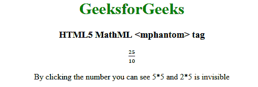

# HTML5 | MathML <mphantom>标签</mphantom>T3】

> 原文:[https://www.geeksforgeeks.org/html5-mathml-mphantom-tag/](https://www.geeksforgeeks.org/html5-mathml-mphantom-tag/)

HTML5 中的 **MathML < mphantom >** 标签用于以不可见的方式渲染，但尺寸仍保持不变。
**语法:**

```html
<mphantom> Child elements </mphantom>
```

**属性:**该标签接受以下列出的一些属性:

*   **class|id|style:** 该属性用于保存子元素的样式。
*   **数学背景:**该属性保存数学表达式背景颜色的值。

下面的例子将说明 HTML 5 MathML 的概念<mphantom>标记:
T2【例子:T4】</mphantom>

## 超文本标记语言

```html
<!DOCTYPE html>
<html>

<head>
    <title>HTML5 mphantom tag</title>
</head>

<body style="text-align:center;">

    <h1 style="color:green">GeeksforGeeks</h1>

    <h3>HTML5 MathML <mphantom> tag</h3>

    <math>
        <maction actiontype="toggle">
            <mfrac>
                <mn>25</mn>
                <mn>10</mn>
            </mfrac>
            <mfrac>
                <mrow>
                    <mphantom>
                        <mn>5</mn>
                        <mo>⋅</mo>
                        <mn>5</mn>
                    </mphantom>
                </mrow>
                <mrow>
                    <mphantom>
                        <mn>2</mn>
                        <mo>⋅</mo>
                        <mn>5</mn>
                    </mphantom>
                </mrow>
            </mfrac>
            <mfrac>
                <mn>2</mn>
                <mn>5</mn>
            </mfrac>
        </maction>
    </math>

<p>
        By clicking the number you can
        see 5*5 and 2*5 is invisible
    </p>

</body>

</html>
```

**输出:**



**支持的浏览器:**支持的浏览器有**html 5 MathML<mphantom>**标签如下:

*   火狐浏览器
*   旅行队