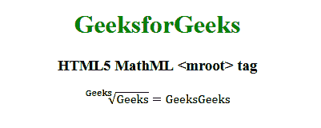

# HTML5 | MathML <mroot>标签</mroot>T3】

> 原文:[https://www.geeksforgeeks.org/html5-mathml-mroot-tag/](https://www.geeksforgeeks.org/html5-mathml-mroot-tag/)

HTML5 中的 **MathML < mroot >标签**是用来显示根的力量像根乡绅。
**语法:**

```html
<mroot> child elements </mroot>
```

**属性:**该标签接受以下列出的一些属性:

*   **class|id|style:** 该属性保存子元素的样式。
*   **数学背景:**该属性保存数学表达式背景颜色的值。
*   **href:** 该属性保存到指定网址的任何超链接。
*   **mathcolor:** 该属性保存数学表达式的颜色。

下面的例子将说明 HTML5 MathML 的概念<mroot>标记:
T2【例子:T4】</mroot>

## 超文本标记语言

```html
<!DOCTYPE html>
<html>

<head>
    <title>HTML5 MathML mroot tag</title>
</head>

<body style="text-align:center;">

    <h1 style="color:green">GeeksforGeeks</h1>

    <h3>HTML5 MathML <mroot> tag</h3>

    <math>
        <mroot>
            <mi>Geeks</mi>
            <mn>Geeks</mn>
        </mroot>
        <mo>=</mo>
        <mtext>GeeksGeeks</mtext>
    </math>
</body>

</html>
```

**输出:**



**支持的浏览器:**以下列出 **HTML5 MathML < mroot >** 标签支持的浏览器:

*   火狐浏览器
*   旅行队